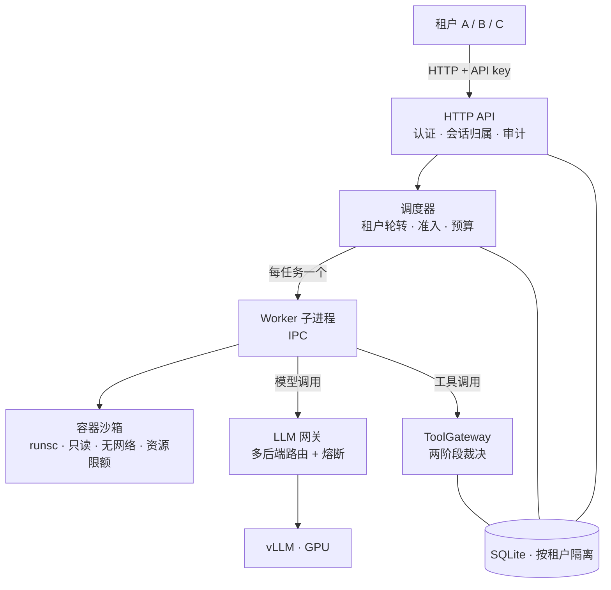

# VRAM-Aware Harness

一个支持团队共享本地大模型的**多租户 Agent 任务服务**。成员在同一台 GPU 服务器上提交 Agent 任务，系统为每个任务分配受策略约束的隔离环境执行，按 GPU 与推理服务状态公平调度，并保证任务可中断、可恢复，执行过程与结果可审计。

技术栈：Bun + TypeScript + SQLite；隔离执行使用 Docker + gVisor(runsc)；推理后端为自托管 vLLM（OpenAI 兼容接口）。

## 功能

**面向用户**

- 邮箱密码注册登录，或使用租户签发的 API Key 接入；数据与工作区按租户隔离
- 按项目创建 Workspace 并组织对话，提交任务后实时查看排队位置与执行输出
- 任务完成后查看最终回答、文件改动（Diff）并下载 Artifact
- 任务可随时中断；崩溃或中断的任务从 Checkpoint 恢复，不确定的工具副作用转人工确认
- 提供 Web 用户工作台（`/app`）与任务控制台

**面向系统**

- **公平调度**：租户内 FIFO、租户间轮转，叠加全局与单租户并发上限；基于 vLLM 显存与队列状态的准入背压，资源恢复后自动继续执行队列中的任务
- **隔离执行**：每个任务一个独立容器——只读根文件系统、丢弃全部 capabilities、默认无网络、限制 CPU / 内存 / 进程数、非 root 运行
- **工具治理**：工具白名单与工作区路径围栏；工具副作用在执行前记账、执行后确认，状态不明时禁止自动重放
- **可靠恢复**：状态与事件先落库，进程重启后重建队列并恢复未完成任务
- **LLM 网关**：OpenAI 兼容代理，多后端路由与熔断、上下文预算裁剪、流式 usage 采集
- **审计**：认证成败、工具裁决、资源准入决策全程落库，按租户可查询

## 工作原理



核心概念自上而下：`Tenant（租户）→ Workspace（项目工作区）→ Session（对话）→ Run（一次任务）→ Attempt（一次实际执行）`，策略、配额与审计都以租户为一等归属边界。

## 快速开始

依赖 [Bun](https://bun.sh)。容器隔离档需要 Linux + Docker + runsc(gVisor)；macOS / 无 Docker 环境可运行全部测试与演示。

```bash
bun install

# 全量测试 + 类型检查 + 无 GPU 端到端 demo
bun run verify:stage0
```

三个不需要真实模型的演示：

```bash
bun run demo:day7        # 资源压力→排队→恢复后自动续跑 + Checkpoint 恢复闭环
bun run demo:console     # 任务控制台：API Key、Workspace、任务历史与结果 API
bun run scripts/user-console-demo-server.ts
# 用户工作台：http://127.0.0.1:3977/app（演示账号 demo@team.local / demo-password-123）
```

连接真实 vLLM 启动服务：

```bash
HARNESS_PORT=13000 \
HARNESS_DATABASE_PATH=./data/harness.sqlite \
HARNESS_WORKSPACE_ROOT=./data/workspaces \
VLLM_BASE_URL=http://127.0.0.1:18000/v1 \
bun run src/main.ts

curl -sS http://127.0.0.1:13000/health && bun run smoke:http
```

在单卡 GPU 服务器（如 A6000 + vLLM）上的完整部署参数见 [deploy/a6000-harness.env](deploy/a6000-harness.env) 与 [部署报告](docs/a6000-deployment-report.zh-CN.md)；容器隔离冒烟：`bun run smoke:container:attacks`（需 Linux + runsc）。

## 配置

常用环境变量（完整清单见 [.env.example](.env.example) 与部署模板）：

| 变量 | 说明 | 默认 |
| --- | --- | --- |
| `HARNESS_PORT` | HTTP 服务端口 | 3000 |
| `HARNESS_DATABASE_PATH` | SQLite 数据库路径 | `./data/harness.sqlite` |
| `HARNESS_WORKSPACE_ROOT` | 租户工作区根目录 | `./data/workspaces` |
| `VLLM_BASE_URL` / `VLLM_MODEL_ID` | 推理后端地址与模型 | — |
| `HARNESS_SANDBOX_PROVIDER` / `_RUNTIME` | 沙箱档：`managed-local` 或 `container`；容器 runtime（`runsc`） | `managed-local` |
| `HARNESS_MAX_ACTIVE_RUNS` / `HARNESS_MAX_ACTIVE_RUNS_PER_TENANT` | 全局 / 单租户并发上限 | 30 / 10 |
| `HARNESS_QUEUE_TTL_MS` / `HARNESS_SCHEDULER_AGING_MS` | 排队超时 / 老化插队阈值 | 300000 / 60000 |
| `HARNESS_GPU_MEMORY_BASELINE_PERCENT` | 同机推理服务显存基线（准入只看其上增量） | 90 |
| `LLM_GATEWAY_STRATEGY` / `VLLM_BASE_URLS` | 网关路由策略与多后端列表 | round-robin |

## 目录结构

```text
src/
├── auth/ http/        # 凭证与认证、HTTP API 与用户工作台
├── scheduling/        # 租户轮转调度、队列协调
├── resources/         # GPU 观测、压力分类、准入策略与预算账本
├── sandbox/           # 沙箱 Provider（container/runsc、managed-local）
├── runtime/ worker/   # Worker 子进程运行时、中断与恢复执行
├── tools/ policies/   # 工具两阶段裁决、五层策略与路径围栏
├── llm-gateway/       # 多后端路由、熔断、上下文预算、流式采集
├── runs/ checkpoints/ # Run 状态机与安全恢复
├── storage/ audit/    # SQLite 迁移、访问审计
└── workspaces/ eval/  # 工作区 Diff/Artifact、评测聚合
tests/                 # 与 src/ 镜像的测试树（98 文件 / 476 项）
scripts/               # 负载发生器、真机供给与端到端脚本
docs/                  # 技术主文档与测试账本
```

## 文档

- [技术主文档](docs/project-handbook.zh-CN.md) —— 系统设计全景
- [全场景测试总索引](docs/scenario-test-index.zh-CN.md) / [覆盖合并账](docs/scenario-coverage-consolidated.zh-CN.md) —— 86 个场景的测试与结果对账
- [已知问题台账](docs/known-issues.zh-CN.md) —— 每条缺陷的根因、修复与复验记录
- [A6000 部署报告](docs/a6000-deployment-report.zh-CN.md) —— 单机真机环境基线
