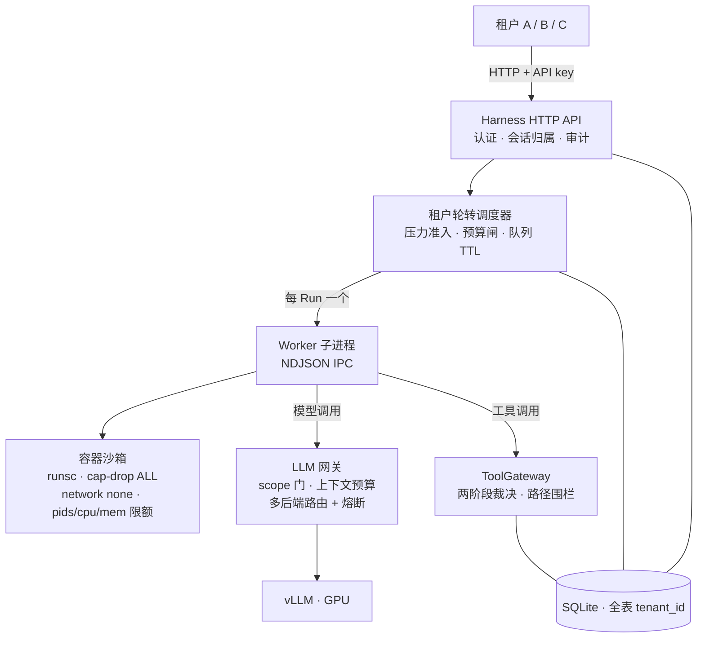

# VRAM-Aware Harness

> 单机单卡上的多租户 Agent 任务服务——给 agent 工作负载写的一个小型「AI OS」。
> One machine, one GPU, many tenants: scheduling, isolation, quota, recovery, and an LLM gateway for agent workloads.

在一台只有一张 GPU 的服务器上，让多个租户各自提交长时运行的 agent 任务（带 bash / 文件工具、多轮对话、单个任务可达数十分钟），并且**互相隔离、互不饿死、崩溃可恢复**——这是本项目回答的全部问题。

OS 管理 CPU 给进程用；这里管理 GPU 给 agent 用。调度、配额、系统调用网关、隔离沙箱、审计——内核职能一件不缺（[与操作系统/数据库的逐层对照](docs/isolation-deep-dive.zh-CN.html)）。

**从这里开始：**[技术主文档](docs/project-handbook.zh-CN.md) · [多租户隔离深潜](docs/isolation-deep-dive.zh-CN.html) · [86 场景测试总索引](docs/scenario-test-index.zh-CN.md) · [缺陷台账（28 条全收口）](docs/known-issues.zh-CN.md)

## 架构总览



对象模型：`Tenant → Workspace → Session → Run → Attempt`，外加围绕租户的策略、配额与审计——多租户是数据、策略、资源与审计归属的一等边界，不是后加的字段。

## 六层隔离

| 层 | 回答的问题 | 核心机制 | 核心实现 |
| --- | --- | --- | --- |
| **L0 身份** | 你是谁 | tenantId 只能从凭证派生（SHA-256 + 恒时比较）；会话抢注 409；越权 404 与「不存在」不可区分 | `src/auth/api-credential-store.ts` |
| **L1 调度** | 能跑多少 | 每租户 FIFO + 轮转 + aging 防饿死；GPU 压力分级准入（只看推理基线之上的增量）；预算账本 commit/settle | `src/scheduling/tenant-run-scheduler.ts` |
| **L2 沙箱** | 在哪跑 | 每 Run 一个 gVisor(runsc) 容器：read-only / cap-drop ALL / no-new-privileges / network none / pids·cpu·mem 限额；创建后用 `docker inspect` 验证运行时证据，不符即销毁 | `src/sandbox/container-sandbox-provider.ts` |
| **L3 工具** | 能做什么 | 五层策略取交集（最小权限）；工具两阶段裁决（副作用前先落 PREPARED，崩溃窗口禁自动重放）；bash 需策略+三种隔离证明同时成立 | `src/tools/tool-gateway.ts` |
| **L4 数据** | 能看什么 | 单库全表 `tenant_id` + 访问层 SQL 强制 WHERE（应用层 RLS）；工作区按租户物理分目录 | `src/runs/runstore.ts` |
| **L5 网关** | 花多少 token | `models:generate` 分权凭证；上下文预算按轮次边界裁剪；多后端路由 + 熔断 | `src/llm-gateway/` |

贯穿两条横切线：**fail-closed**（观测不到就拒绝、证据不符就销毁、无法证明隔离就禁 bash）与**审计**（ALLOW/DENY、策略裁决、工具副作用、路由决策全部落库）。

深度解析（机制 × 核心源码 × 场景实证 × OS/数据库对照）：**[docs/isolation-deep-dive.zh-CN.html](docs/isolation-deep-dive.zh-CN.html)**

## 真机验证（A6000 48GB · Qwen2.5-7B-Instruct · vLLM 0.7.3）

| 指标 | 数值 |
| --- | --- |
| 稳定吞吐 λ\*（闭环 C=4） | **1.146 task/s**（1806s，2069 完成 / 0 失败，正确率 96.8%） |
| 并发阶梯 C=1 / 2 / 4 | 0.293 / 0.580 / **1.153** task/s |
| 过载拐点 | 1.2×–2.0×λ\*（2.0× 时队列 max 48、E2E p95 97.4s，行为有界） |
| 8 小时长稳 | 3505 次沙箱创建/回收 **0 残留**；RSS/FD/线程无泄漏 |
| 场景覆盖 | 86 个场景：84 执行、67 完整通过（[合并账](docs/scenario-coverage-consolidated.zh-CN.md)） |
| 隔离实测 | 跨租户读/写/凭证 **15/15 拒绝**；网关错误矩阵 **14/14**；fork 炸弹在 `--pids-limit` 下 ~40 进程处拦停 |
| 测试 | `bun test` **476 pass / 0 fail**（98 个文件）+ `tsc --noEmit` 全绿 |

## 快速开始

依赖：[Bun](https://bun.sh)。容器隔离档（E2）另需 Linux + Docker + runsc(gVisor)；macOS / 无 Docker 环境可跑 managed-local 档的全部测试与 demo。

```bash
bun install

# ① 无 GPU 本地体验：全量测试 + 类型检查 + 假推理端到端 demo
bun run verify:stage0
```

三个不需要真实模型的演示：

```bash
bun run demo:day7        # 资源压力→排队→恢复自动续跑 + Checkpoint 恢复闭环（出现 RESULT: PASS）
bun run demo:console     # 同源任务控制台：API Key、Workspace、任务历史与结果 API
bun run scripts/user-console-demo-server.ts   # 用户工作台 /app（http://127.0.0.1:3977/app，
                                              # 演示账号 demo@team.local / demo-password-123）
```

起一个真服务（需要可用的 vLLM 端点）：

```bash
HARNESS_PORT=13000 \
HARNESS_DATABASE_PATH=./data/harness.sqlite \
HARNESS_WORKSPACE_ROOT=./data/workspaces \
VLLM_BASE_URL=http://127.0.0.1:18000/v1 \
bun run src/main.ts

curl -sS http://127.0.0.1:13000/health && bun run smoke:http
```

单机 GPU 真机部署：完整参数模板见 [deploy/a6000-harness.env](deploy/a6000-harness.env)，步骤见 [docs/a6000-deployment-report.zh-CN.md](docs/a6000-deployment-report.zh-CN.md)。容器攻击面冒烟（需 Linux + runsc）：`bun run smoke:container:attacks`。

## 仓库结构

| 目录 | 职责 |
| --- | --- |
| `src/auth` `src/http` | API key / 会话凭证、恒时比较、HTTP API 与用户工作台 |
| `src/scheduling` `src/resources` | 租户轮转调度、队列协调、GPU 压力分类、预算账本与准入策略 |
| `src/sandbox` `src/runtime` `src/worker` | 容器沙箱（OCI spec / runsc / warm pool）、Worker 子进程运行时与中断阶梯 |
| `src/tools` `src/policies` | 工具两阶段裁决网关、五层策略交集与路径围栏 |
| `src/llm-gateway` | 多后端路由、熔断、上下文预算、prefix cache、流式 usage 采集 |
| `src/runs` `src/checkpoints` `src/sessions` `src/instances` `src/templates` | Run 生命周期、Checkpoint 恢复、会话 / 实例 / 模板版本化 |
| `src/storage` `src/audit` `src/workspaces` `src/eval` | SQLite 迁移与访问、审计事件、租户工作区与 Diff/Artifact、评测聚合 |
| `tests/` | 与 `src/` 镜像的测试树（98 文件 / 476 项） |
| `scripts/` | 发压器（`campaign/load-driver`）、真机供给（`provision-instance.sh`）、E2 故障注入与冒烟脚本 |
| `docs/` | 技术主文档、场景覆盖账本、缺陷台账、深潜材料（见下） |

## 文档地图

| 文档 | 内容 |
| --- | --- |
| [docs/project-handbook.zh-CN.md](docs/project-handbook.zh-CN.md) | 技术主文档（先读这份建立整体认知） |
| [docs/isolation-deep-dive.zh-CN.html](docs/isolation-deep-dive.zh-CN.html) | 多租户隔离深潜：机制 × 核心代码 × 场景实证 × OS/数据库对照 |
| [docs/scenario-test-index.zh-CN.md](docs/scenario-test-index.zh-CN.md) | 86 个测试场景的总索引（哪份文档、哪台主机、哪个证据） |
| [docs/scenario-coverage-consolidated.zh-CN.md](docs/scenario-coverage-consolidated.zh-CN.md) | 全场景覆盖合并账（查任何场景状态的第一入口） |
| [docs/known-issues.zh-CN.md](docs/known-issues.zh-CN.md) | 缺陷台账：28 条缺陷全部定位根因并收口（§1–§25） |
| [docs/e2e-real-run-walkthrough.zh-CN.md](docs/e2e-real-run-walkthrough.zh-CN.md) | 一个任务从输入到输出的真实闭环走查（未改写的实测 stdout） |
| [docs/a6000-deployment-report.zh-CN.md](docs/a6000-deployment-report.zh-CN.md) | A6000 真机部署报告 |
| [docs/archive/adr/](docs/archive/adr/) | 架构决策记录（ADR 0001–0009：Pi Runtime 选型、MVP 收敛、多租户一等边界等） |

## 诚实边界

- **单机单进程，明确不做 HA / 多机**——实验室项目定位；关键状态先落 SQLite，进程重启可恢复，但账本/路由状态在内存中会重建。
- **GPU 隔离是软的**：A6000 不支持 MIG，所有租户共享同一 vLLM 实例；租户隔离 = 并发 slot + 预算 + 排队，不是显存分区（唯一的硬限制在容器 cgroup 层）。
- **managed-local 沙箱零隔离**，仅限开发：它无法证明文件系统/进程隔离，因此 bash 被 fail-closed 一律禁止；真实含 bash 的负载只能跑容器档。
- **LLM 网关没有每租户 token 限流**（已知最大缺口，修法已预留：账本扩展 token 粒度 + 网关令牌桶）；prefix cache 有意跨租户共享以换命中率。

完整边界与「明确不做」清单见 [docs/defect-register.zh-CN.md](docs/defect-register.zh-CN.md)。

## 状态

2026-09：86 场景覆盖收口、28 条缺陷全部定位根因并修复（含真机复验）、容量与 8 小时长稳实测完成、476 项测试全绿。
