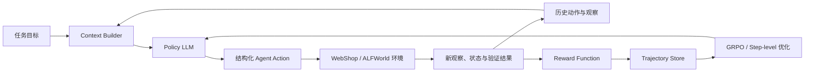

# 多步 LLM Agent 强化学习项目：完整技术方案

> 文档性质：项目立项、技术设计与实验规划；不包含具体代码实现。  
> 建议项目名：**Budget-Aware Step-level Reinforcement Learning for Multi-turn LLM Agents**  
> 中文名：**面向多轮工具智能体的交互预算感知逐步强化学习**  
> 推荐底座：[Agent-R1](https://github.com/AgentR1/Agent-R1)，训练后端使用其兼容的 veRL/GRPO 配置。

## 1. 一句话定义

训练一个会在交互环境中连续行动的大语言模型 Agent，使其不只追求最终任务成功，还能学习何时探索、何时调用工具、何时根据反馈修正、何时停止，从而在成功率、工具调用数、token 消耗和响应时延之间取得更好的折中。

这里的核心不是“让模型回答得更好”，也不是单轮函数调用格式训练，而是将 Agent 的每轮 **观察—行动—环境反馈** 看作一个 RL 决策步骤。

## 2. 项目边界与定位

### 2.1 本项目研究什么

- 多轮 LLM Agent 在工具环境中的策略学习；
- 终局奖励如何分配给多轮行动，即 credit assignment；
- 如何减少循环、无效探索和不必要工具调用；
- 在有限交互预算下保持或提高任务成功率；
- 从一个交互环境训练，在第二个环境验证方法的泛化性。

### 2.2 本项目不研究什么

- 不训练或重训 DeepSeek-V4-Flash；
- 不以 vLLM 显存调度为研究主体；那属于 Agent Harness 项目；
- 不把“工具内化到参数”作为第一阶段目标；
- 不尝试自行搭建一个完整的分布式 RL 框架；
- 不把浏览器自动化、Docker 集群、复杂网页环境作为第一阶段工程重点。

这样与另一个 Harness 项目的关系是互补而不是重复：Harness 研究“多个 Agent Run 如何被可靠、高效地服务”；本项目研究“单个 Agent 的多轮决策策略如何经 RL 改善”。

## 3. 为什么这是真正的 Agentic RL

普通语言模型 RL 常把一次输入到一次输出看作一个样本：

```text
问题 -> 模型输出 -> 奖励
```

而 Agent 在环境中执行的是：

```text
用户目标
  -> 模型选择行动
  -> 工具 / 环境返回观察
  -> 模型基于新观察选择下一行动
  -> ...
  -> 完成、失败或主动终止
```

一个 Agent episode 由若干步组成：

\[
\tau = \{(s_t, a_t, o_{t+1}, r_t, d_t)\}_{t=0}^{T-1}
\]

| 符号 | 含义 | 在项目中的例子 |
|---|---|---|
| \(s_t\) | 当前状态 / 可见上下文 | 用户目标、历史动作、商品页面、上轮工具结果 |
| \(a_t\) | Agent 行动 | 搜索、点击、选择商品、购买、回答、终止 |
| \(o_{t+1}\) | 环境观察 | 搜索结果、商品属性、报错、任务状态 |
| \(r_t\) | 奖励 | 完成任务奖励、无效动作惩罚、交互成本 |
| \(d_t\) | 终止标记 | 成功、失败、超出最大步数、Agent 主动结束 |

因此，Agent 的工具调用不是附属文本，而是会改变环境状态的 action；工具返回也不是普通上下文，而是下一轮决策的 observation。

[Agent-R1](https://github.com/AgentR1/Agent-R1) 的 step-level MDP 表示正是适合本项目的原因：它显式保留 action 边界、工具反馈、状态构造和每步奖励，而不将一段多轮轨迹退化为一条持续增长的 token 序列。

## 4. 问题定义与研究假设

### 4.1 问题

只用最终成功/失败奖励训练 Agent 时，成功轨迹中的每个动作往往被同等鼓励。模型因此可能学会冗长的“多搜几次、多看几页、再确认一次”策略；失败轨迹中的有价值早期动作也难以被区分。

真实部署中，这些冗余行为会带来：

- 更多 token 与模型生成时间；
- 更多工具调用、外部 API 成本和失败面；
- 更长的用户等待时间；
- 在多用户系统中更大的资源竞争。

### 4.2 主假设

> 在逐步 MDP 表示下，将任务成功奖励与经过校准的交互代价共同优化，相比只优化最终任务成功的 trajectory-level RL，可以在不显著降低成功率的前提下，降低无效动作、重复动作、平均工具调用数和平均 episode 长度。

### 4.3 可检验的子假设

1. step-level 训练比将整条轨迹视作单段文本的 trajectory-level 训练更稳定；
2. 轻量的交互预算约束可降低平均行动步数，而不会明显损害成功率；
3. 对无效与重复动作施加明确惩罚，可减少循环行为；
4. 训练中学到的“少而有效地行动”的倾向，能在第二个环境部分迁移。

## 5. 任务环境选择

### 5.1 主环境：WebShop

第一阶段建议只选择 **WebShop**。它模拟“根据自然语言需求购买满足约束的商品”：Agent 需要搜索、浏览商品、选择属性并购买；环境可自动验证购买结果。

选择它的理由：

- 任务是明确的多步工具交互，不是单轮问答；
- 行为空间离散、奖励可验证，便于 RL；
- 训练和评测环境可本地运行，避免依赖不稳定的真实网页；
- 目标、观察、行动和终局成功之间的关系足够直观，适合学习 Agentic RL；
- 与代码 Agent、DeepResearch Agent 不完全重叠。

推荐使用 Agent-R1 已提供的 WebShop recipe 与处理数据，而不是自行重新实现环境协议。

### 5.2 泛化环境：ALFWorld

主实验稳定后，再添加 **ALFWorld** 作为第二环境。它同样是文本交互环境，但任务更接近具身规划，例如寻找物体、移动、操作、完成组合目标。

它的作用不是追求单榜最高分，而是回答一个更可信的问题：方法是否只对“电商搜索/点击”有效，还是对另一类多轮行动问题也有效？

### 5.3 暂不选择的环境

| 候选 | 暂不作为第一阶段的原因 | 适合的后续阶段 |
|---|---|---|
| SQL Agent / Spider | 工程最稳，但工具链与行动空间较窄 | 用作一周跑通 RL 管线的预实验 |
| Search-R1 | 很有价值，但与 DeepResearch 实习的主题较接近 | 后续研究检索—推理交织时使用 |
| SWE-Gym / SWE-bench | 真实且有说服力，但容器、仓库、rollout 成本很高 | 方法验证成熟后的 Coding Agent 迁移 |
| WebArena | 浏览器环境复杂、易受基础设施影响 | 不建议作为个人项目的起点 |

## 6. Agent 结构

Agent 不需要复杂的多 Agent 分工。第一版应是单一 policy model + 固定工具协议。



### 6.1 Context Builder

每一步只向模型提供完成决策所需的信息：

- 原始任务目标；
- 当前环境 observation；
- 受限长度的历史动作—观察记录；
- 可用 action 的格式和约束；
- 剩余交互预算，例如剩余步数。

它不是 Harness 中的长期会话 Context Compiler；这里的目标是为 RL 保持稳定、可复现、不会泄漏答案的训练状态。

### 6.2 Policy Model

建议分两步：

1. 预实验使用 Qwen2.5-1.5B 或 Qwen2.5-Coder-1.5B，跑通 rollout、reward、训练和评测；
2. 主实验使用 3B 量级基础模型；若数据与算力允许，再做 7B 验证。

模型输出必须能被环境解析为受限 action，例如：

```text
search[query]
click[item-id]
buy[item-id]
finish
```

“思考文本”可保留或移除，但应在所有对照组中保持一致，避免它成为混杂变量。

### 6.3 环境适配器

环境适配器负责：

- 将模型 action 解析为环境 action；
- 执行环境并返回 observation；
- 识别非法动作、重复动作、超步数和终局状态；
- 记录完整 step trace；
- 不向模型泄漏隐藏的判分信息。

## 7. 数据与轨迹

### 7.1 数据的两类角色

| 数据类型 | 用途 | 是否可以含参考答案 |
|---|---|---|
| 任务数据 | 训练/验证/测试目标与环境初始状态 | 训练器可见，Agent 不可见 |
| Agent 轨迹 | `(state, action, observation, reward)` 序列 | 由 rollout 生成 |

RL 的主要训练数据不是人工写好的推理过程，而是 policy 与环境交互后新生成的轨迹。

### 7.2 数据切分原则

- 严格区分 train / validation / test；
- 不用测试集调 \(\lambda, \mu, \nu\) 或选择 checkpoint；
- 固定并发布任务 ID、随机种子、最大步数和环境版本；
- 若环境提供官方 split，优先使用官方 split；
- 记录每个 episode 的初始任务、动作序列、环境版本、模型 checkpoint 和采样参数。

### 7.3 轨迹日志最小字段

```text
episode_id, task_id, split, step_id,
state_hash, prompt_tokens, action_text, parsed_action,
observation, valid_action, repeated_action,
reward_components, terminal_reward, done_reason,
latency_ms, input_tokens, output_tokens, checkpoint_id, seed
```

这份日志是项目最重要的可分析资产。没有它，就无法解释“成功率变化究竟来自更好的决策，还是更长、更昂贵的尝试”。

## 8. 算法与对照组

### 8.1 训练流程

每次迭代的逻辑为：

1. 从训练任务集中取一个 batch；
2. 对每个任务用当前 policy 采样 \(G\) 条多步 rollout；
3. 对每个 rollout 执行环境、得到完整轨迹与奖励；
4. 在同一任务的 rollout group 内计算相对优势；
5. 使用 GRPO 更新 policy，并使用参考模型/ KL 项约束更新幅度；
6. 定期在固定 validation 集上评测，按预先声明指标选择 checkpoint。

GRPO 的适合之处是：它不需要额外训练 value model，而是在同一任务的多个候选轨迹之间计算相对好坏，适合终局可验证的 Agent 环境。

### 8.2 必须做的对照

| 名称 | 训练方式 | 目的 |
|---|---|---|
| M0 | Base / SFT agent，不做 RL | 建立最低可用基线 |
| M1 | 只用最终成功奖励的 trajectory-level GRPO | 检验“只看最后结果”的效果 |
| M2 | step-level 表示，但只使用最终成功奖励 | 分离“表示方式”的收益 |
| M3 | step-level + 交互预算奖励 | 主方法 |
| M4 | M3 去掉重复/无效动作项 | 消融：惩罚项是否有用 |

任何“方法有效”的结论都至少需要与 M1、M2 比较；只与未训练模型比较不够。

### 8.3 主方法：交互预算感知逐步奖励

对一条 episode 的总奖励定义为：

\[
R(\tau) = R_{\text{task}} - \lambda N_{\text{action}} - \mu N_{\text{invalid}} - \nu N_{\text{repeat}}
\]

| 项 | 来源 | 含义 |
|---|---|---|
| \(R_{\text{task}}\) | 环境官方验证器 | 是否真正完成用户目标；这是主奖励 |
| \(N_{\text{action}}\) | action 计数 | 交互成本，避免无限探索 |
| \(N_{\text{invalid}}\) | action parser / 环境 | 格式错误、无效目标等 |
| \(N_{\text{repeat}}\) | 轨迹检测器 | 相同或无新信息的重复行动 |

其中 \(\lambda\) 必须很小，且只在 validation 上选择。项目目标不是盲目缩短轨迹，而是得到“成功率—成本”的 Pareto 改善。

### 8.4 每步奖励分配

为避免将所有成本都留到最后，可记录每步局部项：

\[
r_t = -\lambda - \mu \mathbb{1}[\text{invalid}_t] - \nu \mathbb{1}[\text{repeat}_t]
\]

终局时加入 \(R_{\text{task}}\)。

第一版不应引入基于 LLM judge 的过程奖励；它会使 reward 是否可靠成为另一个研究问题。优先采用环境可验证信号与可审计的规则信号。

## 9. 评测设计

### 9.1 主指标：任务成功

- 官方 success rate / reward；
- 在固定测试任务、固定最大步数下执行；
- 至少报告多个随机种子或置信区间；
- 不在测试集上选择超参数。

### 9.2 Agent 效率指标

| 指标 | 含义 | 为什么重要 |
|---|---|---|
| Avg. steps | 平均环境行动数 | 最直接的 Agent 交互成本 |
| Avg. tool calls | 平均工具调用数 | 反映外部依赖与成本 |
| Invalid action rate | 非法 action 占比 | 反映 action protocol 是否可靠 |
| Repeat / loop rate | 重复或循环轨迹比例 | 反映是否真正减少无效探索 |
| Input / output tokens | 每任务 token 消耗 | 更接近真实模型成本 |
| End-to-end latency | 任务完成总时延 | 部署视角的用户体验 |

### 9.3 必须画出的图

1. success rate 随训练步数变化；
2. average steps 随训练步数变化；
3. success rate vs. average steps 的 Pareto 图；
4. 不同 \(\lambda\) 下的成功率—成本曲线；
5. action 类型分布；
6. 失败类型分布：非法动作、重复循环、预算耗尽、目标未满足；
7. 至少 3 个完整轨迹案例：基线冗余、主方法有效、主方法失败。

### 9.4 泛化评测

将 M1/M2/M3 在 ALFWorld 上用相同的训练预算或迁移设置比较。结论应谨慎表述：

- 若两个环境均有效：说明方法具有跨环境证据；
- 若只在 WebShop 有效：说明它是环境内有效的 interaction-efficient policy，不能泛化宣称；
- 若成功率提高但步数也显著增加：说明模型更会尝试，但尚不能说“更高效”。

## 10. 实验可复现性要求

每次正式实验必须固定并记录：

- 基础模型与具体 revision；
- LoRA / 全参数训练方式；
- 环境、数据集与容器版本；
- task split 与任务 ID；
- prompt、tool schema、最大历史长度；
- 最大行动步数、最大输出 token；
- rollout group size、temperature、top-p；
- 学习率、batch size、KL 系数、奖励权重；
- 随机种子；
- GPU、CUDA、PyTorch、vLLM、veRL 版本；
- git commit、配置文件哈希、训练曲线与原始 JSONL 轨迹。

不要用“某次跑出来的最好 checkpoint”作为唯一结果。至少以多个 seed 的平均值和波动报告主指标。

## 11. 分阶段实施计划

### Phase 0：先理解，不训练

目标：能解释一次 Agentic RL rollout 从模型生成到 reward 再到梯度更新的完整数据流。

- 阅读 Agent-R1 的 WebShop / ALFWorld recipe；
- 运行一个未训练 Agent 的 20 个任务 dry-run；
- 保存、人工阅读 5 条成功与 5 条失败轨迹；
- 写清环境 action、observation、terminal verifier 与 reward 来源。

验收：能画出真实 trajectory，且每个 reward 都可追溯到环境状态或规则。

### Phase 1：最小可运行 RL

目标：在极小训练集和小模型上跑通训练闭环。

- 使用 1B–1.5B 模型；
- 小任务子集、少量训练 step；
- 先运行 M0 与 M1；
- 验证 reward 不全为零、action 可解析、训练 loss 正常、评测可复现。

验收：训练前后能输出 success rate、平均步数与完整轨迹日志，不追求提升。

### Phase 2：建立可信基线

目标：完成 M0/M1/M2。

- 固定正式训练/验证/测试 split；
- 固定模型、prompt、最大步数和总 rollout 预算；
- 重复至少 2–3 个随机种子；
- 分析 trajectory-level 与 step-level 表示的差异。

验收：获得一张可复现的基线表，而不是单个最好结果。

### Phase 3：主方法与消融

目标：完成 M3/M4 和 reward 权重扫描。

- 定义 invalid/repeat 的严格可审计规则；
- 选择少量 \(\lambda\) 候选值；
- 用 validation 选择一个主配置；
- 在 test 上仅运行一次正式汇报；
- 解释每种失败模式的变化。

验收：证明或证伪主假设，形成 success–cost Pareto 图和完整消融。

### Phase 4：泛化与包装

目标：在 ALFWorld 或另一类任务上验证，并将结果整理为项目作品。

- 迁移同一训练逻辑；
- 不为第二环境重新发明一套方法；
- 对比是否仍减少冗余交互；
- 写 README、实验表、配置文件、运行说明与结果复现说明。

验收：形成“一个主环境的严谨结论 + 一个跨环境证据”，而不是堆叠许多未跑完整的 benchmark。

## 12. 算力与部署现实

你目前两张 RTX PRO 6000 的大部分显存被线上 DeepSeek 模型占用。需要明确：Agent RL 训练不是在剩余几十 GB 中“顺便跑一下”的任务。

训练通常同时存在：

- 可训练 policy；
- frozen reference policy；
- optimizer states 和 activation；
- rollout 推理引擎；
- 多条并发、多步、长上下文轨迹；
- 环境进程与可能的工具服务。

建议策略：

1. 开发期使用小模型、极少 rollout，优先验证系统；
2. 正式训练安排在推理服务停机窗口，或使用独立租用 GPU；
3. 从 LoRA/QLoRA、小 batch、短最大步数开始；
4. 训练与线上 vLLM 服务物理隔离，不在同一 GPU 上争抢显存；
5. 先测出单个 rollout、一个训练 step 的峰值显存，再扩大规模。

Agent Lightning 的公开 SQL 教程以 Qwen2.5-Coder-1.5B 为默认示例，并建议完整训练至少使用 40GB 显存；这可以作为“跑通训练链路”的现实参考，而不是保证所有 Agent 环境的实际下限。[官方教程](https://microsoft.github.io/agent-lightning/latest/how-to/train-sql-agent/)

## 13. 风险与避免方式

| 风险 | 常见表现 | 控制方式 |
|---|---|---|
| Reward hacking | Agent 为少走步骤过早结束 | 以任务成功为主指标，报告 Pareto 曲线 |
| 训练不稳定 | reward 全零、KL 爆炸、loss 异常 | 先小规模 dry-run，检查每条轨迹 |
| 环境泄漏 | 模型从 observation 直接获得答案 | 人工审查 prompt 与环境返回 |
| 不公平对比 | 各实验最大步数、prompt 或模型不同 | 建立统一 config，锁定变量 |
| 过拟合单环境 | WebShop 高、其他环境无效 | 第二环境做泛化验证 |
| 工程吞没研究 | 花大量时间搭集群和网页环境 | 第一版只使用成熟 recipe 与本地环境 |
| 把“少步骤”当作成功 | 成功率下降却只宣传成本下降 | 始终联合汇报成功率与成本 |

## 14. 最终交付物

项目完成时，应至少有：

- 一份问题定义与方法说明；
- 可运行的 Agent-R1 配置与环境适配记录；
- 固定数据 split、任务清单和随机种子；
- M0–M4 的完整实验表；
- 原始 trajectory logs 与分析脚本；
- success–steps / success–token Pareto 图；
- 跨环境实验；
- 失败案例分析；
- 可复现 README；
- 一页项目摘要，供简历和面试使用。

## 15. 简历与面试表述模板

在没有实验结果前，使用“构建/设计/实现”，不要预写虚构的提升数字。

> 构建面向多轮工具智能体的 step-level Agentic RL 训练系统，将 Agent 的工具调用与环境反馈建模为显式 MDP transition；基于 GRPO 研究终局任务成功与交互预算的联合优化，并在公开交互式任务环境中评测任务成功率、工具调用成本、重复动作率与跨环境泛化能力。

有结果后再补充真实指标，例如：

> 在固定公开任务集上，相比 trajectory-level GRPO，在保持任务成功率的前提下将平均交互步数降低 X%、重复动作率降低 Y%，并在第二交互环境上观察到一致趋势。

## 16. 推荐阅读与复现顺序

1. [Agent-R1](https://github.com/AgentR1/Agent-R1)：主框架、step-level MDP、WebShop/ALFWorld recipes；
2. [Agent Lightning SQL Agent 教程](https://microsoft.github.io/agent-lightning/latest/how-to/train-sql-agent/)：用于最快理解 Agent rollout、GRPO 与可验证环境；
3. [Search-R1](https://github.com/mianzhang/Search-R1)：理解搜索—推理交织的工具 Agent RL；
4. [SWE-Gym](https://github.com/SWE-Gym/SWE-Gym)：后续向真实 Coding Agent RL 扩展时参考；
5. [Tool-N1](https://github.com/NVlabs/Tool-N1) 与 [When2Call](https://github.com/NVIDIA/When2Call)：补充函数调用正确性和“是否该调用工具”的局部能力评测。

## 17. 开工前的最终决策

本项目第一版应固定为：

```text
框架：Agent-R1
主环境：WebShop
泛化环境：ALFWorld（Phase 4 才加入）
模型：先 1B–1.5B，主实验尝试 3B
算法：GRPO
主对比：trajectory-level vs. step-level vs. step-level + interaction budget
主结果：任务成功率 × 平均行动步数的 Pareto 改善
```

只有当 Phase 2 的基线完全可信后，才进入“更复杂的 credit assignment”“工具内化”或“迁移到 Coding Agent”的后续研究。先把一条严谨、闭环、可复现的 Agentic RL 主线跑完，比同时覆盖搜索、网页、代码和多 Agent 更有价值。
