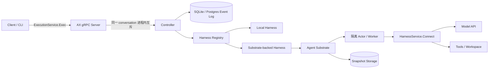
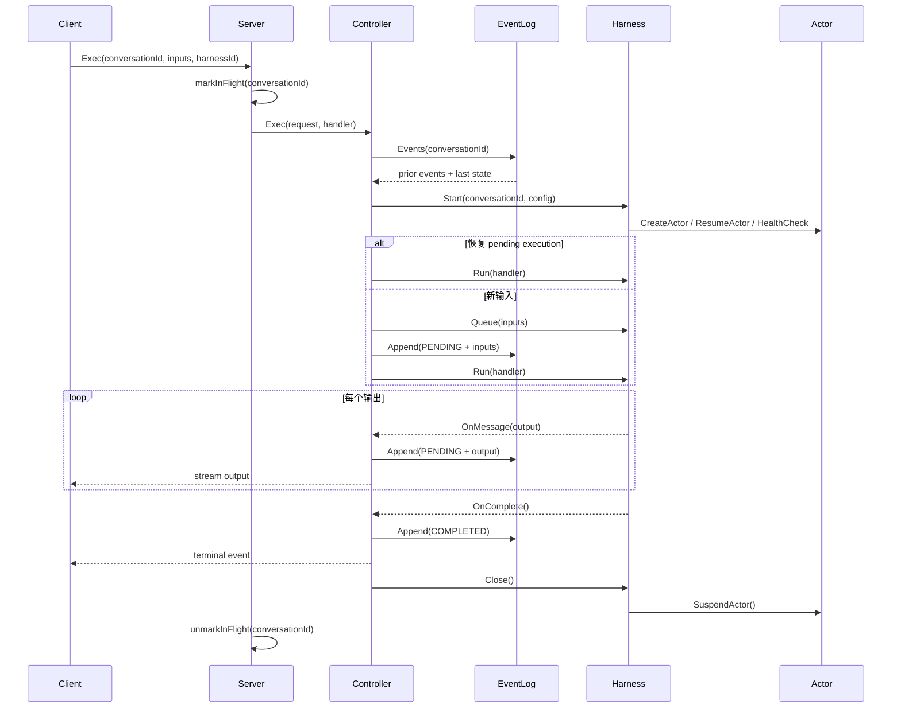
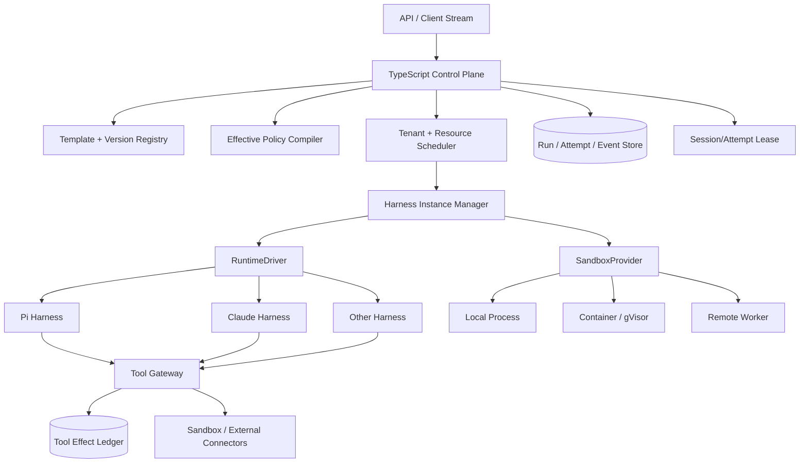

# Google AX 深度源码解析：从“可恢复 Agent Harness”到我们的异构执行控制面

> **定位说明（2026-08-12）**：本文保留为外部系统源码分析。涉及异构 Runtime、
> 分布式 Substrate 和长期控制面的建议不代表当前实施优先级；只采用其中能直接
> 加强多租户 Sandbox、任务编排、恢复契约、故障注入和审计证据的部分。当前路线见
> [多租户 Agent 任务服务路线图](multi-tenant-agent-task-service-roadmap.zh-CN.md)。

> 分析基线：`google/ax` commit `f327e23b5b842e9b700675ded9a6cdb79c505856`（2026-07-28）  
> 本地源码：`/Users/mac/Desktop/agent_harness/google-ax`  
> 分析对象：AX 的真实代码、测试和部署清单，而不只是 README 中的目标描述  
> 本文面向：准备阅读 AX 源码，并希望判断哪些设计适合迁移到本项目的工程人员

---

## 0. 先给结论

AX 最值得我们参考的，并不是“Google 用 Go 写了一个分布式 Agent 系统”，而是它把一个长生命周期 Agent 执行问题拆成了三个相对独立的层次：

1. **逻辑执行层**：Controller 决定一次对话是新执行还是恢复执行，并把输入、输出和终态写入 Event Log。
2. **Harness 层**：不同 Agent 实现只要满足一个很窄的 `Start / Queue / Run / Close` 契约，就能被同一个控制器驱动。
3. **计算环境层**：Agent Substrate 负责创建、恢复、健康检查和挂起隔离环境，并保存进程、文件系统等更完整的运行状态。

这个分层与我们的方向高度相似，但两者的核心重心并不相同：

- AX 当前更像一个“**可挂起、可恢复的 Agent 执行器**”。
- 我们当前要做的是“**面向团队共享本地模型的多租户 Agent 任务服务**”；AX 中
  与第③ Sandbox、第④任务编排、恢复和审计有关的机制可作为内部实现参考，异构
  Runtime 与分布式控制面只保留为远期材料。

因此，我们不应该照搬 AX，而应该吸收它的窄接口、单写者语义、逻辑日志与计算快照分层、Harness 私有状态隔离、恢复契约测试；同时保留并强化我们已经领先于 AX 当前代码的部分：

- Tool Gateway 与工具副作用账本；
- `PREPARED / SUCCEEDED / FAILED` 工具执行状态；
- Resource Admission 与租户公平调度；
- Effective Policy 与 Capability Profile 的设计方向；
- `Session / Run / Attempt` 的显式分层；
- 对“恢复模型状态”和“恢复外部世界副作用”的严格区分。

一句话概括：

> **AX 最值得学的是 Harness 生命周期的分层方式；我们最不该丢的是资源、策略和副作用治理。**

---

## 1. 阅读 AX 时必须先建立的边界

### 1.1 AX 不是 Agent Framework

AX 不负责定义 ReAct、Plan-and-Execute、Multi-Agent Collaboration 等上层认知框架。它关心的是：

- 一个 Harness 如何启动；
- 对话如何绑定到 Harness；
- 输入和输出怎样记录；
- 进程退出后如何恢复；
- 计算环境如何创建、挂起和恢复；
- 客户端如何通过流式协议消费执行结果。

所以，AX 中的 `Harness` 更接近“可被控制平面驱动的 Agent Runtime Adapter”，而不是“某一种 Agent 算法”。

### 1.2 README 描述的是方向，代码描述的是当前事实

AX 的 README 使用了 distributed、resumable、single-writer、event log 等很强的术语。但在本次分析的提交中：

- 同一 conversation 的 single-writer 由单进程内存 `map` 保证；
- Controller 的“不完整执行恢复”仍有 TODO；
- `last_step` 已进入协议，但 Controller 尚未利用它做客户端补发；
- Postgres Event Log 并不自动解决多副本并发写入；
- 失败和取消未形成完全统一的终态落盘路径；
- 部署清单明确标注为 experimental / incomplete。

本文用以下标签区分成熟度：

| 标签 | 含义 |
|---|---|
| **已实现** | 当前提交中有完整生产路径或明确测试覆盖 |
| **部分实现** | 有协议或主体代码，但语义存在缺口 |
| **设计方向** | README、注释或 TODO 描述，当前代码尚未闭环 |
| **本文推论** | 根据代码行为得出的工程判断，不代表 AX 官方承诺 |

### 1.3 四种状态不能混为一谈

长生命周期 Agent 至少有四类状态：

| 状态层 | 例子 | AX 的主要载体 | 我们的主要载体 |
|---|---|---|---|
| 逻辑执行状态 | 输入、输出、pending、completed | Event Log | Run Event / RunStore |
| 模型对话状态 | interaction cursor、session history | Antigravity DB / cursor | Pi session file / runtimeSessionRef |
| 计算环境状态 | 进程、内存、工作区、网络端点 | Agent Substrate snapshot | 未来 SandboxProvider / Instance |
| 外部副作用状态 | 邮件是否已发、文件是否已写、API 是否已调用 | 当前没有统一账本 | ToolExecutionStore / Tool Gateway |

AX 的价值在于它明确处理了前三层中的大部分；我们的独特价值在于把第四层也纳入恢复正确性。

---

## 2. AX 的总体架构与状态所有权



这张图最关键的不是组件数量，而是每个组件对哪一类状态负责。

| 组件 | 它拥有的状态 | 它不应该拥有的状态 |
|---|---|---|
| Server | 当前进程内的 in-flight conversation 集合 | 持久化执行真相 |
| Controller | 执行顺序、Harness 选择、事件写入时机 | Harness 的私有模型状态 |
| Event Log | 可回放的逻辑事件序列 | 工作进程内存、文件系统完整快照 |
| Harness Registry | Harness ID 到实现的映射 | 每个 conversation 的业务状态 |
| Harness | 模型循环、私有 cursor、工具实现 | 全局租户调度与资源公平性 |
| Agent Substrate | Actor 生命周期、环境恢复、快照 | Agent 的业务语义和工具幂等语义 |

这个状态所有权划分是 AX 最强的部分之一。很多 Agent 系统的问题不是“缺少 checkpoint”，而是所有状态都堆在一个 session JSON 中，最终没人知道：

- 哪个状态是 authoritative；
- 哪个状态可以重算；
- 哪个状态恢复时必须原子提交；
- 哪个状态只是缓存；
- 哪个状态与外部副作用有关，绝不能盲目重放。

---

## 3. 核心协议：AX 如何定义一次执行

核心协议位于：

- [`proto/ax.proto`](https://github.com/google/ax/blob/f327e23b5b842e9b700675ded9a6cdb79c505856/proto/ax.proto)
- [`proto/content.proto`](https://github.com/google/ax/blob/f327e23b5b842e9b700675ded9a6cdb79c505856/proto/content.proto)

### 3.1 四个容易混淆的概念

#### Conversation

Conversation 是跨多轮长期存在的逻辑身份。它负责把以下信息关联起来：

- 历史事件；
- 所使用的 Harness；
- Harness 私有状态；
- Substrate 中的 Actor；
- 后续恢复请求。

AX 用 `conversation_id` 作为大量资源的稳定关联键。这种做法简单，但也带来一个隐含耦合：Conversation 同时承担了业务会话 ID、并发控制键和计算实例恢复键。

我们的模型中更适合把它拆成：

```text
Session：用户可见的长期上下文
  └── Run：一次用户目标或任务执行
        └── Attempt：一次具体运行尝试，可因故障重试或迁移
```

这样，Session 可以固定 Harness Template，而每个 Attempt 可以绑定不同实例、资源池或 worker lease。

#### Execution

`Execution` 是某个 Harness 在某个 conversation 上的一次活动句柄。它不是 Event Log 中显式建模的 Attempt 实体，而是 Go 进程里的运行时对象。

#### ConversationEvent

`ConversationEvent` 是 Event Log 的基本记录，包含：

- `conversation_id`
- `step`
- `exec_id`
- `harness_id`
- `harness_config`
- `messages`
- `state`

它同时承担“输入/输出消息”和“执行状态变化”两种职责，模型非常紧凑，但会导致后续查询、审计和状态机扩展变得困难。

#### Harness

Harness 是具体 Agent Runtime。AX 要求一个已存在的 Conversation 不能随意切换 Harness，因为不同 Harness 的私有状态格式和恢复机制不可互换。

这一约束非常值得我们直接采用：

> **Session 创建时固定 `templateId + templateVersion`；后续 Run 默认继承。若迁移 Harness，必须走显式 migration，而不是覆盖一个字符串。**

### 3.2 为什么有两个 gRPC Service

AX 把协议分成两面：

```proto
service ExecutionService {
  rpc Exec(ExecRequest) returns (stream ConversationEvent);
}

service HarnessService {
  rpc Connect(stream HarnessClientMessage)
      returns (stream HarnessServerMessage);
}
```

- `ExecutionService` 面向外部客户端：客户端提交输入，服务端流式返回事件。
- `HarnessService` 面向运行中的 Harness：Controller/Adapter 向 Harness 发 start 或 cancel，Harness 回传 output 和 end。

这是一条很好的架构边界。外部 API 不直接等于内部 runtime protocol，因此未来可以：

- 更换 Harness 的传输方式；
- 本地进程与远程 worker 共用上层语义；
- 保持客户端协议稳定；
- 在内部协议中加入心跳、背压、取消确认、恢复游标等能力。

### 3.3 `HarnessService.Connect` 是一个有终止帧的流协议

逻辑上的协议如下：

```text
Client -> Harness: Start（必须是首帧）
Client -> Harness: Cancel（可选）
Harness -> Client: Output（0..N）
Harness -> Client: End（恰好一次）
```

设计亮点是：gRPC stream EOF 不等于业务完成。Harness 必须发送明确的 `End`，Controller 才能知道是：

- 正常完成；
- 执行失败；
- 用户取消。

这比把 socket 断开当作任务结束可靠得多。我们的 `RuntimeEvent` 已经有 `interrupted`、`resumed` 等丰富事件，下一步可以借用这个思想：

```ts
type RuntimeTerminalEvent =
  | { type: "completed"; resultRef?: string }
  | { type: "failed"; errorCode: string; retryable: boolean }
  | { type: "canceled"; actor: string; reason?: string };
```

关键不只是定义类型，而是保证：**每个 Attempt 最终只能提交一个终态，并且终态与最后的 checkpoint 在同一事务边界中持久化。**

### 3.4 Content 模型的优点与局限

`content.proto` 使用 oneof 表示：

- thought
- text
- image / audio / document / video
- confirmation
- tool_call
- tool_result

优点是不同模型输出统一成结构化内容，避免上层解析字符串。局限是 `confirmation` 与普通内容混在一起，而确认实际上是一个需要暂停执行、等待授权、记录授权主体的控制状态。源码里也留下了移除它的 TODO。

我们的 Policy / Tool Gateway 不应把 approval 仅仅当成一条聊天消息。更合适的模型是：

```text
Attempt WAITING_FOR_APPROVAL
  approval_request_id
  requested_capability
  normalized_tool_intent
  policy_snapshot_id
  expires_at
```

这使批准、拒绝、超时和恢复都能进入状态机与审计日志。

### 3.5 协议已经预留，但当前尚未闭环的字段

`ExecRequest.last_step` 很重要：它暗示客户端重连后可以告诉服务端“我已经看到第 N 步”，服务端只补发 N 之后的事件。但在当前 Controller 代码中，它没有进入恢复或 catch-up 逻辑。

因此当前提交中要区分：

- **服务端执行恢复**：部分存在；
- **客户端事件流恢复**：协议预留，但未闭环；
- **工具副作用恢复**：没有统一实现。

---

## 4. 从 `ax exec` 到 Harness 完成：逐步跟踪真实调用链

这一节是阅读 AX 最重要的主线。



### 4.1 Server：进程内 single-writer gate

入口在 [`internal/server/server.go`](https://github.com/google/ax/blob/f327e23b5b842e9b700675ded9a6cdb79c505856/internal/server/server.go)。Server 先调用类似下面的逻辑：

```go
if !s.markInFlight(conversationID) {
    return status.Error(codes.AlreadyExists, "already in flight")
}
defer s.unmarkInFlight(conversationID)
```

它解决的是：同一个 AX 进程内，不允许两个 goroutine 同时驱动同一 Conversation。

它没有解决：

- 两个 AX 副本同时收到相同 conversation；
- 进程失联后旧 writer 的 lease 何时失效；
- 网络分区形成双 writer；
- worker 完成但 controller 尚未提交事件时谁接管；
- 横向扩容后的 owner fencing。

所以，“single-writer”在当前代码里是一条重要不变量，但不是完整的分布式实现。

### 4.2 Controller：真正的语义核心

核心位于 [`internal/controller/controller.go`](https://github.com/google/ax/blob/f327e23b5b842e9b700675ded9a6cdb79c505856/internal/controller/controller.go)。它大致做四件事：

1. 扫描历史事件，推导 Resumption State；
2. 确定本次应使用的 Harness；
3. 判断是恢复 pending execution，还是排入新输入；
4. 在 Harness 回调时持久化输出和终态。

其行为可以简化为：

```text
历史最后状态是 PENDING：
  Start -> Run
  不重新 Queue 已经提交的输入

存在新输入：
  Start -> Queue -> LogInputs(PENDING) -> Run

历史是终态且没有新输入：
  没有新的工作
```

这里有一个非常好的语义：**恢复 pending execution 时不重新 Queue 输入。** 因为输入已经进入过 Harness，重复 Queue 可能导致模型重复回答或工具重复执行。

但这条语义只有在 Harness 私有状态确实恢复成功时才成立。若 Event Log 显示 PENDING，而 Harness cursor 或计算快照丢失，Controller 需要进入一种显式的不确定状态，而不能继续假装可恢复。

我们可以把它建模为：

```text
Attempt.RECOVERING
  ├── runtime state available -> RESUMING
  ├── safe checkpoint available -> RESTARTING_FROM_CHECKPOINT
  └── side effect ambiguity -> MANUAL_REVIEW
```

### 4.3 Harness 绑定：一个不起眼但很重要的约束

Controller 扫描历史事件取得首次记录的 Harness ID：

- 后续请求未指定 Harness：使用历史 Harness；
- 后续请求指定相同 Harness：允许；
- 后续请求尝试切换 Harness：拒绝；
- 新 Conversation 未指定：使用 default Harness，并把 canonical ID 写入事件。

这是非常值得借鉴的。我们的 Template 不能只是提交 Run 时的可选参数，而应成为可追溯绑定：

```ts
interface SessionBinding {
  sessionId: string;
  templateId: string;
  templateVersion: number;
  runtimeKind: RuntimeKind;
  createdCapabilitySnapshotId: string;
}
```

这样即使默认模板后来升级，历史 Session 的恢复语义也不会漂移。

### 4.4 输出顺序：先落日志，再发客户端

Controller 的 handler 在收到 Harness output 时，先尝试 Append Event Log，再把消息转发给客户端。这体现了一个正确方向：客户端看见的内容应该可以从日志重建。

但当前实现中，日志写失败只记录 warning，消息仍可能继续发给客户端。于是会出现：

```text
客户端已经看见 output N
Event Log 里只有 output N-1
客户端重连后无法补回 N
```

对交互聊天，这可能只是重复显示；对工具请求、审批请求或计费事件，则可能破坏一致性。

我们的建议是区分两种事件：

- **Durable event**：必须先成功持久化，才能向外可见；
- **Ephemeral telemetry**：允许 best-effort，例如 token streaming delta。

可采用 outbox 风格：

```text
transaction:
  append durable run event
  update attempt projection
  append delivery outbox

stream publisher:
  deliver outbox -> mark delivered
```

### 4.5 完成、失败、取消并不对称

正常完成会由 handler 写入 `COMPLETED`。但当前 Controller 的错误返回路径没有统一保证追加 `FAILED` 或 `CANCELED`；某些异常可能留下最后状态为 `PENDING`。

这意味着下一次请求可能把“确定失败”误判为“需要恢复”。恢复系统中，这种终态缺失比普通错误更危险，因为它改变后续控制流。

我们的 Attempt 状态机应强制：

```text
RUNNING -> COMPLETED
RUNNING -> FAILED_RETRYABLE
RUNNING -> FAILED_TERMINAL
RUNNING -> INTERRUPTED
RUNNING -> CANCELED
RUNNING -> RECOVERY_REQUIRED
```

所有退出路径必须经过一个统一的 finalizer，且状态提交应具备 CAS/fencing 条件，防止旧 worker 覆盖新 Attempt。

### 4.6 一个值得在读码时验证的细节：`exec_id`

Controller 的 logger 结构拥有 `execID` 字段，事件模型也有 `exec_id`，但在当前主路径中没有看到它由 `Execution.ID()` 注入 logger。这意味着本提交中 Event Log 的 `exec_id` 可能为空。

这不是吹毛求疵。没有稳定 Attempt/Execution ID，就无法可靠回答：

- 哪些输出属于同一次运行尝试？
- 重试前后如何分组？
- 哪个 worker 产生了某条事件？
- 某次计费、工具调用属于哪个 Attempt？

我们应把 `Attempt` 作为一级实体，而不是仅依赖 Run Event 中的可选字段。

---

## 5. Single-writer：为什么它如此重要，又为什么一个 map 不够

### 5.1 Single-writer 简化了什么

只允许一个 writer 驱动某个 Conversation 后，很多问题突然简单了：

- Harness 的 cursor 可以 last-write-wins；
- Event Log 的 step 可以顺序递增；
- 不需要每个私有状态都做 CAS；
- 模型循环无需合并并发消息；
- 工具执行顺序天然线性；
- 恢复时只需要寻找最后一个合法状态。

这也是 AX 文档强调 single-writer 的原因。它不是性能优化，而是正确性模型。

### 5.2 Event Log 的 step 分配依赖 single-writer

SQL Event Log 位于：

- [`internal/controller/eventlog/eventlog.go`](https://github.com/google/ax/blob/f327e23b5b842e9b700675ded9a6cdb79c505856/internal/controller/eventlog/eventlog.go)
- [`internal/controller/eventlog/sql.go`](https://github.com/google/ax/blob/f327e23b5b842e9b700675ded9a6cdb79c505856/internal/controller/eventlog/sql.go)
- [`internal/controller/eventlog/sqlite.go`](https://github.com/google/ax/blob/f327e23b5b842e9b700675ded9a6cdb79c505856/internal/controller/eventlog/sqlite.go)
- [`internal/controller/eventlog/postgres.go`](https://github.com/google/ax/blob/f327e23b5b842e9b700675ded9a6cdb79c505856/internal/controller/eventlog/postgres.go)

Append 的核心策略是：

```sql
SELECT COALESCE(MAX(step), 0) + 1
FROM conversation_events
WHERE conversation_id = ?;
```

然后写入以 `(conversation_id, step)` 为主键的记录。

SQLite 使用 busy timeout 和 immediate transaction，能在单机中提供较直观的互斥行为。Postgres 版本则明确把并发安全责任交给调用方。

如果两个副本同时计算 `MAX(step)+1`，它们会争抢同一个 step：

- 一个事务成功；
- 另一个因主键冲突失败；
- 若上层只是 retry，事件顺序与 owner 身份仍未解决。

因此 Postgres 只是“可共享持久化”，不是“自动获得分布式 single-writer”。

### 5.3 真正的多副本 single-writer 需要什么

至少需要：

```text
conversation/session ownership lease
  owner_id
  fencing_token（单调递增）
  lease_expires_at
  heartbeat_at
```

所有关键写入携带 fencing token：

```sql
UPDATE attempts
SET state = 'COMPLETED'
WHERE attempt_id = :id
  AND fencing_token = :current_token;
```

旧 owner 即使网络恢复，也无法覆盖新 owner 的状态。

对我们而言，这不需要现在就实现，但模型必须预留：

- 当前 [TenantRunScheduler](../src/scheduling/tenant-run-scheduler.ts) 是内存调度器；
- 当前 [PiAdapter](../src/runtime/pi-adapter.ts) 的活动 session 也在进程内 Map；
- SQLite 足够支撑单节点 Stage 0/1；
- 当进入多副本时，应增加 LeaseStore、Attempt owner 和 fencing token，而不是把内存 Map 换成 Redis 就宣布“分布式完成”。

### 5.4 对我们最现实的采用方式

短期明确写入不变量：

> 同一 `sessionId` 同一时刻最多有一个 active Attempt；同一 `attemptId` 只有一个 runtime owner。

单节点先由进程内 gate + SQLite 状态保证；多节点再替换为数据库 lease。这样语义先稳定，机制可以演进。

---

## 6. Event Log：它能恢复逻辑历史，但不能恢复整个世界

### 6.1 AX Event Log 的优点

AX 的 EventLog 接口刻意小：

```go
type EventLog interface {
    Append(context.Context, *ConversationEvent) (int32, error)
    Events(context.Context, string) ([]*ConversationEvent, error)
    DeleteAll(context.Context, string) error
    Close() error
}
```

优点：

- SQLite 与 Postgres 共用同一个契约；
- 测试容易复用；
- Controller 不依赖具体数据库；
- 事件 payload 用 protobuf JSON，初期演进成本低；
- step 顺序清楚，便于恢复扫描。

### 6.2 但它不是完整 Event Sourcing

当前 `ResumptionState` 会完整扫描 Conversation 的所有事件，再取：

- 第一个 Harness ID；
- 最后一个非 unspecified 状态。

这对早期实现足够，但长期会遇到：

- Conversation 很长时全量扫描成本上升；
- JSON payload 不利于按 tenant、attempt、tool、状态查询；
- 没有 snapshot/compaction 边界；
- schema migration 与历史重放需要额外纪律；
- 事件类型与聚合状态混在一个 message 中；
- 缺少 expected version，使并发写冲突不够显式。

更稳健的接口可以是：

```ts
interface RunEventStore {
  append(input: {
    runId: string;
    attemptId: string;
    expectedVersion: number;
    fencingToken: number;
    events: DomainEvent[];
  }): Promise<{ newVersion: number }>;

  readAfter(runId: string, version: number): Promise<StoredEvent[]>;
}
```

### 6.3 事件与 projection 必须区分

建议我们保留两类数据：

- **不可变事件**：用于审计、恢复、调试；
- **可重建 projection**：用于快速查询当前 Run/Attempt 状态。

一次提交可以原子完成：

```text
append AttemptStarted event
update attempt.status = RUNNING
record owner/fencing token
```

AX 当前主要依靠事件扫描推导状态；我们已有 RunStore，可以继续保持查询友好，但要确保 projection 的变化有对应的 durable event。

### 6.4 `last_step` 给我们的启示

即使 AX 当前未用它，`last_step` 仍然指出了一个正确的客户端恢复协议：

```text
客户端持有 lastSeenSequence
断线重连发送 lastSeenSequence
服务端先回放 durable events
再切换到 live stream
```

这里必须处理 replay/live race：在订阅 live 之前读取日志，可能漏事件；先订阅再读取，可能重复。可通过统一 cursor、数据库通知/outbox 或“先注册 subscription，再按 sequence 去重”解决。

---

## 7. Harness 抽象：AX 最应该被我们借走的设计

核心接口位于 [`internal/harness/harness.go`](https://github.com/google/ax/blob/f327e23b5b842e9b700675ded9a6cdb79c505856/internal/harness/harness.go)。它非常窄：

```go
type Harness interface {
    Start(ctx context.Context, conversationID string, config []byte) (Execution, error)
}

type Execution interface {
    Run(ctx context.Context, handler Handler) error
    Queue(ctx context.Context, msg ...*proto.Message) error
    ID() string
    Close(ctx context.Context) error
}
```

### 7.1 为什么窄接口比“大一统 Agent API”更好

它只抽象所有 Harness 共有的生命周期：

- 定位或创建一次执行；
- 加入输入；
- 运行并产生事件；
- 清理资源。

它没有强迫所有 Harness 都支持：

- fork；
- rewind；
- steering；
- tool approval；
- model switching；
- remote sandbox；
- multimodal input；
- snapshot。

如果把这些全塞进基础接口，新 Harness 只能实现大量假能力。更好的方式是基础生命周期 + Capability Profile。

### 7.2 AX 接口的不足：能力不可发现

AX Registry 主要是 ID 到 Harness 实现的映射，`harness_config` 是 opaque bytes。Controller 并不知道某个 Harness：

- 能否暂停；
- 是否支持 steering；
- 是否支持工具审批；
- 状态保存在本地还是远端；
- 需要多少 GPU/VRAM；
- 允许哪些 sandbox backend；
- 支持什么恢复等级。

这正是我们应该扩展的部分。

### 7.3 适合我们的 TypeScript 契约

不要把当前 [AgentRuntime](../src/runtime/agent-runtime.ts) 推翻。可以在其外层形成三部分 Adapter：

```ts
interface RuntimeDriver {
  start(input: StartAttemptInput): Promise<RuntimeHandle>;
  resume(input: ResumeAttemptInput): Promise<RuntimeHandle>;
  interrupt(handle: RuntimeHandle, reason: string): Promise<void>;
  events(handle: RuntimeHandle): AsyncIterable<RuntimeEvent>;
  close(handle: RuntimeHandle): Promise<void>;
}

interface CapabilityReporter {
  describe(): Promise<CapabilityProfile>;
}

interface PolicyCompiler<TemplateConfig, RuntimeConfig> {
  compile(input: {
    template: TemplateConfig;
    tenantPolicy: TenantPolicy;
    platformPolicy: PlatformPolicy;
    capabilities: CapabilityProfile;
  }): Promise<EffectivePolicy<RuntimeConfig>>;
}
```

职责分别是：

- `RuntimeDriver`：如何运行；
- `CapabilityReporter`：能做什么；
- `PolicyCompiler`：本次允许做什么，以及怎样转换成 runtime 参数。

这比直接复制 AX 的 opaque `harness_config []byte` 更适合多租户异构控制面。

### 7.4 Harness 配置必须版本化、可验证、可审计

Opaque config 对通用 runtime 很方便，但不应原样穿过控制面。建议流程：

```text
用户配置
  -> Template schema validation
  -> Capability compatibility check
  -> Tenant policy intersection
  -> Platform hard limits
  -> EffectivePolicySnapshot
  -> Adapter-specific runtime config
```

落盘的不是一份随时会变化的“当前策略引用”，而是本次 Attempt 的 effective snapshot，包括：

- template/version；
- capability profile version；
- policy revision；
- 最终允许的 tools/network/filesystem/model；
- 资源需求与分配结果；
- 编译后的 runtime config hash。

---

## 8. 三层恢复，以及 AX 尚未覆盖的第四层

### 8.1 第一层：逻辑事件恢复

Event Log 告诉 Controller：

- 之前是否有输入；
- 产生过哪些输出；
- 最后状态是否 PENDING；
- Conversation 绑定哪个 Harness。

它不能告诉 Controller：模型服务是否已经生成结果但响应丢失，也不能恢复进程内存。

### 8.2 第二层：Harness 私有状态恢复

Antigravity integrations Harness 使用 interaction cursor。其实现位于：

- [`internal/harness/antigravityinteractions/`](https://github.com/google/ax/tree/f327e23b5b842e9b700675ded9a6cdb79c505856/internal/harness/antigravityinteractions)

cursor 以 Conversation ID 的 SHA-256 派生路径保存，写入采用：

```text
write temporary file
fsync
atomic rename
```

这避免进程在半次写入时留下损坏 cursor。成功 interaction 后更新 cursor，下一次从前一 interaction 继续。

但 cursor 只证明“模型交互链走到了哪里”，不证明：

- tool call 的外部副作用完成与否；
- 响应是否已被 Controller durable log；
- 计算环境中的所有文件都与 cursor 同步；
- 第三方 API 是否支持幂等重试。

### 8.3 第三层：计算环境恢复

Agent Substrate 提供 Actor 的 Create / Resume / Suspend 和 snapshot。它可以恢复：

- 工作目录；
- 进程状态或运行环境；
- Harness 私有数据库；
- 本地缓存与依赖。

这非常适合 coding agent，因为“代码仓库 + shell 进程 + runtime 状态”很难压缩成一个业务 JSON checkpoint。

### 8.4 第四层：外部副作用恢复

这是我们必须坚持的差异化能力。

假设 Agent 执行：

```text
调用支付 API -> 支付成功 -> 进程崩溃 -> 未写 tool result
```

恢复完整 VM 并不能撤销支付，也不能证明是否应重试。只有工具级执行账本与幂等键能处理这种情况。

我们当前 [ToolExecution](../src/tools/tool-execution.ts) 的设计已经区分：

- `READ_ONLY`
- `IDEMPOTENT_WRITE`
- `UNKNOWN_EFFECT`

并记录：

- `PREPARED`
- `SUCCEEDED`
- `FAILED`

[ToolGateway](../src/tools/tool-gateway.ts) 会在调用前写 PREPARED，成功后把 tool result 与 checkpoint 绑定提交。这个方向比“恢复 Harness 后继续运行”更严格。

### 8.5 故障场景矩阵

| 故障 | AX 当前可依赖信息 | 仍有歧义 | 我们应如何处理 |
|---|---|---|---|
| 客户端断线，Harness 仍运行 | Event Log、live execution | 客户端漏了哪些流事件 | sequence + replay/live handoff |
| Controller 在输入落盘后崩溃 | PENDING 事件、Harness 状态 | Harness 是否已真正接收输入 | input command ID + Harness ack |
| Harness 输出后、日志前崩溃 | Harness cursor/快照可能存在 | output 是否应重放 | durable output ID + dedupe |
| Worker 崩溃 | Substrate snapshot | 快照与 Event Log 是否同一逻辑点 | checkpoint manifest + event version |
| 模型完成、响应丢失 | provider cursor 可能可查 | 是否会重复计费/生成 | provider request ID + reconciliation |
| 工具已写外部系统、结果未保存 | AX 无统一账本 | 能否安全重试 | ToolExecution PREPARED + idempotency evidence |
| 旧 owner 复活 | 进程内 map 无法防止 | 双 writer | lease + fencing token |

### 8.6 恢复不是一个布尔能力

Capability Profile 不应只有 `supportsResume: boolean`。建议至少表达：

```ts
type RecoveryLevel =
  | "NONE"
  | "CONVERSATION_ONLY"
  | "CHECKPOINTED_RUNTIME"
  | "SUSPEND_RESUME_INSTANCE";

interface RecoveryCapabilities {
  level: RecoveryLevel;
  supportsOutputReplay: boolean;
  supportsSteeringReplay: boolean;
  externalEffectsTracked: boolean;
  maxCheckpointAgeMs?: number;
}
```

调度器和恢复服务才能根据真实能力作出决策，而不是假设所有 Harness 都能无损恢复。

---

## 9. Agent Substrate 适配器：真正的“分布式/隔离”主要在这里

实现位于 [`internal/harness/substrate/substrate.go`](https://github.com/google/ax/blob/f327e23b5b842e9b700675ded9a6cdb79c505856/internal/harness/substrate/substrate.go)。

### 9.1 `Start` 的真实步骤

Substrate-backed Harness 的 `Start` 大致执行：

```text
CreateActor(conversationId)
  AlreadyExists -> 可接受，体现幂等创建
ResumeActor(conversationId)
  必须返回 Actor 和 Worker IP
dial worker gRPC
health check with exponential backoff
return Execution handle
```

健康检查从约 100ms 退避到 2s，总超时 60s。注意：Resume API 成功并不等于 Harness 已可服务，所以 readiness gate 是必要的。

这一点可以直接借鉴到我们的 `HarnessInstance`：

```text
PROVISIONING -> STARTING -> READY -> LEASED -> DRAINING -> SUSPENDED
                              \-> UNHEALTHY
```

调度器只能把 Attempt 分配给 `READY` 且 Capability/Policy 匹配的实例。

### 9.2 `Run` 与 `Close`

`Run` 会：

1. 取出 pending messages；
2. 建立 `HarnessService.Connect`；
3. 发送 start；
4. 关闭客户端发送方向；
5. drain 输出直到 End。

`Close` 会先关闭连接，再使用独立 background context 在约 10 秒内请求 SuspendActor。使用独立 context 很重要：原始请求 context 很可能已经取消，清理动作不应因此完全跳过。

但 Suspend 失败目前主要记录日志，不一定升级为可协调的资源状态。生产控制面应把它交给 reconciler：

```text
desiredState = SUSPENDED
observedState = RUNNING
lastError = ...
nextReconcileAt = ...
```

### 9.3 我们应该抽象 Provider，而不是直接依赖 Substrate

适合我们的接口可能是：

```ts
interface SandboxProvider {
  ensureInstance(spec: InstanceSpec): Promise<InstanceRef>;
  resume(ref: InstanceRef): Promise<ConnectionInfo>;
  waitReady(ref: InstanceRef, signal: AbortSignal): Promise<void>;
  suspend(ref: InstanceRef): Promise<SnapshotRef | undefined>;
  terminate(ref: InstanceRef): Promise<void>;
  inspect(ref: InstanceRef): Promise<ObservedInstanceState>;
}
```

本地阶段可以实现 `LocalProcessProvider`，未来再增加：

- Docker / containerd；
- Kubernetes Pod；
- gVisor sandbox；
- VM / Firecracker；
- Agent Substrate-compatible provider。

### 9.4 现在不该照搬的部分

我们还没进入需要全套 Kubernetes CRD、快照 bucket、gVisor worker 的阶段。过早引入会带来：

- 运维复杂度；
- 镜像兼容矩阵；
- snapshot 版本迁移；
- 网络和证书管理；
- 资源回收与孤儿 Actor；
- 本地开发成本。

Stage 1–3 更合理的工作是先稳定 `SandboxProvider` 契约、实例状态机和 readiness 语义。

---

## 10. Antigravity：为什么 AX 同时有 Go 和 Python

AX 的 Go 主体并不意味着所有 Agent Runtime 都用 Go。Antigravity 适配本身分为两种重要形态。

### 10.1 Python sidecar Harness

相关文件：

- [`internal/harness/antigravity/antigravity.go`](https://github.com/google/ax/blob/f327e23b5b842e9b700675ded9a6cdb79c505856/internal/harness/antigravity/antigravity.go)
- [`python/antigravity/harness_server.py`](https://github.com/google/ax/blob/f327e23b5b842e9b700675ded9a6cdb79c505856/python/antigravity/harness_server.py)

Go 适配器负责：

- 解出内嵌 Python assets；
- 安装或启动 sidecar；
- 等待 TCP ready；
- 通过标准 HarnessService 连接。

Python sidecar 负责：

- 调用 Antigravity SDK；
- 为每个 Conversation 建立保存目录和数据库；
- 应用 request-level config overlay；
- 实现真正的模型/工具循环。

这是“控制面语言”和“Runtime 生态语言”解耦的直接证据。即使 AX 控制面用 Go，它也不要求 Harness 用 Go。

### 10.2 私有状态必须放在 Agent 工作区之外

Antigravity 把内部状态放到类似 `~/.ax/...` 的位置，而不是 Agent 可自由修改的 workspace。

这是一个容易被忽略的安全不变量：

> Agent 能修改任务文件，不等于 Agent 能修改恢复游标、策略快照、工具账本或审计记录。

我们应明确分区：

```text
/workspace       Agent 可见、按策略读写
/runtime-state   Harness 私有、Agent 不可写
/control-state   控制面持久化、worker 不直接访问
/secrets         短期挂载、最小权限、不可进入 checkpoint
```

### 10.3 Interactions Harness：一个完整的 model-tool loop

[`internal/harness/antigravityinteractions/`](https://github.com/google/ax/tree/f327e23b5b842e9b700675ded9a6cdb79c505856/internal/harness/antigravityinteractions) 的实现会：

1. 读取上次 interaction cursor；
2. 向模型提交 turn；
3. 成功后原子保存 cursor；
4. 发出文本内容；
5. 解析 tool calls；
6. 在 Harness 内部执行工具；
7. 把 tool results 和 queued steering 加入下一轮；
8. 直到没有后续工作或达到 MaxTurns。

它提供 view file、run command、list directory、move、delete、create/edit file 等工具，也提供 ThirdPartyExecutor 扩展点。

### 10.4 内部执行工具的好处与风险

好处：

- 模型循环低延迟；
- Harness 可以针对 SDK 深度优化；
- Controller 不需要理解所有工具协议；
- sidecar 更自治。

风险：

- 中央控制面看不到完整的 tool intent；
- 审批、租户策略和审计可能被绕开；
- 恢复时无法统一判断副作用；
- 不同 Harness 的安全语义会漂移；
- 工具执行资源难以统一计量。

我们的折中方案应是：Harness 可以拥有 model loop，但高风险工具必须通过标准 Tool Gateway：

```text
Harness
  -> normalized ToolIntent
  -> Tool Gateway
  -> Policy decision
  -> PREPARED ledger
  -> sandbox/connector execution
  -> result + checkpoint atomic commit
```

低风险、纯本地、只读工具可以由 sandbox 内快速执行，但仍应通过可配置的 policy adapter，并输出统一审计事件。

### 10.5 一个协议细节：取消与 steering

Interactions gRPC server 支持首帧 start 和后续 cancel，但当前明确不支持在同一个 Connect 流中继续 steering；新的 steering 通过下一次 Connect 和持久化 cursor 继续。

这告诉我们不要把几个概念混在一起：

- `queueInput`：给当前执行加入用户输入；
- `steer`：改变正在运行的推理方向；
- `interrupt`：停止当前 Attempt；
- `resume`：从持久状态继续；
- `fork`：从某个历史点创建新分支。

它们应分别出现在 Capability Profile 中，而不是统一叫“支持多轮”。

---

## 11. Go 的选择：适合基础设施，但不是分布式能力的来源

AX 用 Go 很合理，主要因为：

- gRPC/protobuf 工具链成熟；
- goroutine 和 channel 适合大量流连接、健康检查和取消传播；
- `context.Context` 形成统一 deadline/cancellation 约定；
- 静态二进制便于容器部署；
- Kubernetes、容器和可观测性生态天然偏 Go；
- 对进程、网络、TLS、后台 daemon 生命周期控制直接；
- 较强的编译期类型约束适合协议和基础设施代码。

但 Go 不会自动提供：

- distributed lock；
- exactly-once；
- durable queue；
- leader election；
- event consistency；
- tool idempotency；
- recovery correctness。

当前 AX 的 process-local in-flight map 正好证明：语言适配的是工程形态，不替代分布式协议设计。

TypeScript 对我们同样合理，因为我们的核心复杂度是：

- Harness 生态适配；
- 策略组合；
- Tool Gateway 与 connector；
- API/UI 快速演进；
- 多租户领域模型；
- 资源和恢复决策编排。

未来如果 worker 侧需要极低开销守护进程、容器 runtime 深度集成或高并发流代理，可以使用 Go/Rust node agent，而控制面继续用 TypeScript。语言边界可以与 plane 边界一致：

```text
TypeScript Control Plane
  - template / policy / tenant / scheduling / audit

Go or Rust Execution Agent（可选）
  - sandbox lifecycle / process supervision / stream proxy / metrics

Python / TS / Go Harness
  - model SDK / agent loop / runtime-specific state
```

---

## 12. 配置、Registry、Skills 与可观测性

### 12.1 Config 是装配层，不是策略层

[`internal/config/config.go`](https://github.com/google/ax/blob/f327e23b5b842e9b700675ded9a6cdb79c505856/internal/config/config.go) 描述：

- server；
- SQLite/Postgres；
- Antigravity；
- interactions；
- Substrate-backed custom Harness；
- skills；
- telemetry。

配置版本为 v1alpha，并验证 default Harness 等关系。这适合系统装配，但不等于多租户 policy resolution。

我们的 Template、Tenant Policy、Platform Policy 不应直接合并进一个 YAML 后传给 Runtime；必须保留来源、优先级与拒绝原因。

### 12.2 Registry 需要从“实现映射”升级为“可调度目录”

AX 当前 registry 主要解决：`harness_id -> Harness implementation`。

我们的目录至少需要：

| 实体 | 用途 |
|---|---|
| HarnessTemplate | 用户可选择、可版本化的逻辑配置 |
| AdapterDefinition | runtime kind 到 adapter factory |
| CapabilityProfile | 某版本 adapter/instance 的真实能力 |
| HarnessInstance | 已创建或可恢复的运行实例 |
| ResourcePool | 实例可落在哪类资源上 |
| EffectivePolicySnapshot | 某次 Attempt 最终允许的能力 |

### 12.3 Skills 的归一化值得参考

AX 的 skills 层把 local 或 remote source 归一化成 `Available / Group / Skill`，冲突采用 first-wins，再以目录和 system instruction 暴露给 Harness。

值得借鉴的是“先归一化、后交给 runtime”，而不是每个 Harness 自己理解 GitHub、目录、企业 skill store。

但生产系统还需要：

- source revision pinning；
- digest/signature；
- tenant allowlist；
- 恶意 instruction 扫描；
- 可见性与授权；
- 下载缓存和供应链审计；
- skill 所需工具权限与 Effective Policy 的交集。

### 12.4 Telemetry 不是审计

AX 使用 OpenTelemetry 是正确的基础设施选择，但 trace/span 不能替代业务审计。Telemetry 可能采样、丢失或按成本清理；审计日志需要明确保留策略和不可变语义。

我们应关联以下 ID：

```text
tenantId -> sessionId -> runId -> attemptId
         -> harnessInstanceId -> workerId
         -> modelRequestId -> toolExecutionId
         -> traceId
```

这样才能从一次用户任务一路追到模型成本、资源分配、工具副作用和恢复决策。

---

## 13. 测试：AX 把恢复语义写进了可执行规范

AX 的测试比接口本身更能说明作者真正承诺了什么。

### 13.1 Controller 恢复测试

[`internal/controller/controller_test.go`](https://github.com/google/ax/blob/f327e23b5b842e9b700675ded9a6cdb79c505856/internal/controller/controller_test.go) 覆盖了关键流程：

| 场景 | 预期 |
|---|---|
| 新 Conversation + 新输入 | Start / Queue / Run 各一次 |
| 历史 PENDING + 无新输入 | Start / Run，不 Queue |
| 历史 PENDING + 又有新输入 | 先恢复旧执行，再启动并 Queue 新一轮 |
| 恢复请求不指定 Harness | 使用历史 Harness |
| 恢复时试图换 Harness | 拒绝 |
| 使用 default Harness | 日志写 canonical Harness ID |

这类测试不是单元实现细节，而是生命周期 contract test。未来所有 Adapter 都应通过同一组测试。

### 13.2 Event Log contract tests

SQLite 与 Postgres 共享 EventLog 行为测试，保证：

- step 自动递增；
- 查询按 step 排序；
- payload 可往返；
- 删除和关闭语义一致。

我们也应为存储层建立 backend-neutral contract tests，尤其是未来从 SQLite 切到 Postgres 时，不能只验证 SQL 能跑，而要验证并发、事务与恢复不变量。

### 13.3 Substrate 生命周期测试

Substrate 测试覆盖：

- Create → Resume → health → Connect → Suspend；
- Create 已存在可继续；
- Resume 返回 nil Actor 或无 IP 时失败；
- Harness 返回 failed end 时传播错误。

这套思路可直接用于我们的 SandboxProvider contract。

### 13.4 我们应该补的测试矩阵

结合 AX 的优点和当前缺口，建议增加：

1. **Adapter lifecycle contract**：start/resume/interrupt/close 的一致语义。
2. **Harness binding contract**：历史 Session 不能静默漂移模板版本。
3. **Terminal event contract**：每个 Attempt 恰好一个终态。
4. **Recovery ambiguity contract**：UNKNOWN_EFFECT + PREPARED 必须 MANUAL_REVIEW。
5. **Output durability contract**：durable output 未落盘时不能对外确认。
6. **Owner fencing contract**：旧 owner 无法写入新 Attempt。
7. **Capability compatibility contract**：模板要求超出实例能力时拒绝调度。
8. **Policy intersection contract**：Adapter config 永远不超过 effective policy。
9. **Sandbox readiness contract**：provider 返回实例不等于可接任务。
10. **Crash-point tests**：在每个事务边界注入崩溃，验证恢复决策。

---

## 14. 当前提交的成熟度审计

### 14.1 已实现且值得认真学习

| 能力 | 评价 |
|---|---|
| 窄 Harness 生命周期接口 | 简洁、可替换，是最值得借鉴的设计 |
| Conversation 固定 Harness | 保护恢复兼容性，测试覆盖明确 |
| 进程内 single-writer | 单节点语义清楚，但不可误认为分布式锁 |
| SQLite/Postgres EventLog | 存储抽象小，contract test 思路好 |
| Substrate create/resume/readiness/suspend | 计算层与逻辑层分离清楚 |
| Antigravity sidecar | 证明控制面与 Harness 可以跨语言 |
| 原子 cursor 写入 | 私有恢复状态实现扎实 |
| terminal frame | 业务终态不依赖网络 EOF |
| skills source normalization | runtime 前归一化扩展源，方向合理 |

### 14.2 部分实现或存在语义缺口

| 能力 | 当前缺口 | 对我们的提醒 |
|---|---|---|
| 不完整执行恢复 | Controller 有 TODO，主要依赖 PENDING + Harness 自恢复 | 显式建模 recovery state 与 evidence |
| 客户端 catch-up | `last_step` 未接入 Controller | 统一 durable sequence 与 replay/live handoff |
| 多副本 single-writer | 只有进程内 map | lease + fencing token |
| 失败/取消落盘 | 与完成路径不完全对称 | 统一 Attempt finalizer |
| `exec_id` 关联 | 主路径可能未写入 | Attempt 作为一级实体 |
| 日志/客户端一致性 | log append 失败可能继续发送 | durable outbox 或失败即中止 |
| canceled stream 处理 | `DrainStream` 只显式把 FAILED 当错误 | canceled 必须是独立终态 |
| Tool policy/approval | 工具可在 Harness 内直接执行 | 中央 Tool Gateway 与 policy evidence |
| opaque harness config | Controller 无法理解风险与能力 | schema + effective policy compiler |
| 安全默认值 | 部分连接路径存在 insecure 或 skip verify 取舍 | mTLS、identity、secret/checkpoint 边界 |
| 部署 | manifests 标注实验性/不完整 | 不把部署示例等同生产方案 |

### 14.3 对这些观察应保持版本意识

以上判断只针对固定 commit `f327e23...`。AX 更新很快，未来可能修复这些问题。我们在实现借鉴项时应记录来源 commit，而不是引用浮动的 `main`。

---

## 15. 我们应该“直接借、改造后借、暂时不借”的清单

### 15.1 可以直接借鉴的原则

| 原则 | 怎样落到我们项目 |
|---|---|
| 每个 Session/Conversation 单写者 | 明确 active Attempt 唯一性 |
| Harness 生命周期接口保持窄 | 保留 AgentRuntime 基础接口，不堆可选能力 |
| Harness 绑定不可静默变化 | 固定 template ID + version |
| 业务终态使用明确终止事件 | Attempt 恰好一个 terminal event |
| 逻辑日志与计算快照分层 | Run Event 不承担恢复整个 workspace |
| Harness 私有状态与 workspace 隔离 | 独立 runtime-state mount |
| readiness 是独立步骤 | SandboxProvider 必须 waitReady |
| 清理不依赖已取消请求 context | reconciler 接管 suspend/terminate |
| 后端共享 contract tests | SQLite/Postgres、local/remote provider 共用规范 |

### 15.2 应改造后借鉴

| AX 设计 | 我们的改造 |
|---|---|
| Conversation | `Session -> Run -> Attempt` |
| Harness Registry | Template + Adapter + Capability + Instance Registry |
| opaque harness_config | schema validation + EffectivePolicySnapshot |
| EventLog full scan | immutable events + projection + snapshot/sequence |
| process-local inFlight | 本地 gate，未来 lease + fencing |
| Actor = conversation ID | instanceRef 与 sessionId 解耦，可复用/迁移 |
| Harness 内部工具执行 | 高风险工具强制 Tool Gateway |
| resume boolean intuition | RecoveryLevel + evidence |
| completion callback | terminal event + checkpoint transaction |
| Substrate concrete client | provider-neutral SandboxProvider |

### 15.3 暂时不要照搬

- 不要为了“看起来分布式”现在就引入 Kubernetes CRD、gVisor 和快照集群。
- 不要复制 coarse 的 `PENDING / FAILED / COMPLETED / CANCELED` 作为全部领域状态。
- 不要把所有 Harness 参数作为 opaque bytes 直接穿透租户边界。
- 不要把进程内 Map 当成多副本并发保证。
- 不要允许 Adapter 绕过 Tool Gateway 执行高风险外部副作用。
- 不要假设恢复了容器/VM，就恢复了工具执行正确性。
- 不要把 default Harness 的当前值用于历史 Session；必须固化版本。
- 不要把 telemetry 当作 durable audit log。

---

## 16. 与我们当前代码的逐项映射

我们的组合根位于 [create-harness-application.ts](../src/app/create-harness-application.ts)，当前已经装配：

- SQLite；
- RunStore / CheckpointStore；
- ToolExecutionStore / PolicyDecisionStore；
- ToolGateway；
- PiAdapter；
- ResourceObserver / ResourceAdmission；
- TenantRunScheduler / QueuePump；
- RecoveryService。

这意味着我们不是从 AX 的起点开始。更准确的映射如下：

| AX | 我们当前 | 下一步 |
|---|---|---|
| `Harness` | [AgentRuntime](../src/runtime/agent-runtime.ts) | 外层形成 RuntimeDriver + capabilities + compiler |
| Harness Registry | `RuntimeKind = PI` 与应用装配 | Adapter Registry + versioned Template |
| Conversation | 当前 Run/会话概念 | 固化 Session / Run / Attempt 边界 |
| `Execution` | PiAdapter 内 active session | 显式 RuntimeHandle / Attempt binding |
| EventLog | RunStore events | 加 expected sequence、terminal invariant |
| ResumptionState | [RecoveryService](../src/checkpoints/recovery-service.ts) | 引入 evidence 和 recovery level |
| Actor | 尚无统一 Instance | HarnessInstance + SandboxProvider |
| Substrate snapshot | Checkpoint | 区分 logical checkpoint 与 instance snapshot |
| internal tool execution | [ToolGateway](../src/tools/tool-gateway.ts) | 保持中央治理优势 |
| process in-flight map | [TenantRunScheduler](../src/scheduling/tenant-run-scheduler.ts) 内存状态 | owner lease 演进点 |
| Harness config | [HarnessTemplate](../src/templates/harness-template.ts) 初始骨架 | version + schema + effective snapshot |

### 16.1 我们现有设计比 AX 更强的地方

#### 工具副作用

[tool-execution.ts](../src/tools/tool-execution.ts) 明确不允许把 `IDEMPOTENT_WRITE` 当成“名字听起来幂等就能自动重试”，当前缺乏稳定 idempotency evidence 时选择 fail closed。这是正确的保守策略。

#### 资源进入执行决策

[resource-admission-service.ts](../src/resources/resource-admission-service.ts) 和资源分类/策略让实际资源事实影响 admit 或 queue。AX 的 Controller 当前不负责 GPU/VRAM admission，主要把计算环境交给 Substrate。

#### 租户公平

[tenant-run-scheduler.ts](../src/scheduling/tenant-run-scheduler.ts) 已经做租户轮转与并发槽限制。虽仍是单进程，但领域语义已经存在。

#### 恢复证据

[recovery-decision.ts](../src/checkpoints/recovery-decision.ts) 会因无 checkpoint 或不安全工具副作用转入 MANUAL_REVIEW，而不是一律 resume。这比“最后状态 PENDING 就继续”更可信。

### 16.2 AX 能补强我们的地方

#### 真实的 Harness/Instance 生命周期

我们的 PiAdapter 当前主要通过进程内 session Map 和 Pi session file 工作，还缺少统一 `Start -> Ready -> Run -> Suspend/Close` 实例抽象。

#### 强制 Harness 绑定

当前 Template 骨架还需要把 `templateId + version` 固化到 Session/Run，而不是只在 runtime factory 层选择 PI。

#### 远程 Runtime Protocol

AX 的 ExecutionService / HarnessService 分离，为未来 remote worker 给出了很好的协议样板。我们可以先定义 transport-neutral driver，再决定是否上 gRPC。

#### 恢复合同测试

我们已有 recovery logic，但还应像 AX 一样，用相同 contract test 跑所有 runtime adapter 和 storage backend。

---

## 17. 建议的目标架构



这张图与 AX 的本质区别是：

- Harness 不直接决定最终权限；
- Instance 不等于 Session；
- Attempt 有独立 owner 和恢复证据；
- 工具副作用与 runtime checkpoint 分开记录；
- 资源调度、租户公平是控制面的一级职责。

---

## 18. 分阶段落地建议

### P0：现在就做，先稳定语义

#### 1. 引入 Attempt 一级实体

最少字段：

```ts
interface AttemptRecord {
  id: string;
  runId: string;
  ordinal: number;
  state: AttemptState;
  runtimeKind: RuntimeKind;
  runtimeSessionRef?: string;
  harnessInstanceId?: string;
  effectivePolicySnapshotId: string;
  startedAt?: string;
  terminalAt?: string;
  recoveryReason?: string;
}
```

验收标准：一次恢复或重试不覆盖原执行记录，而是产生新 Attempt 或显式恢复同一 Attempt。

#### 2. 固化 Session 的 Harness Template 版本

验收标准：默认模板升级后，旧 Session 仍使用原版本；不兼容迁移必须显式失败。

#### 3. 定义 Capability Profile

首版至少包含：

- streaming；
- resume level；
- interrupt；
- steering；
- tool mediation；
- sandbox types；
- model families；
- resource requirements。

#### 4. 统一终态提交

验收标准：任何 runtime 返回、异常、取消或进程退出路径，都会产生恰好一个 terminal event；重复 finalization 幂等。

#### 5. Adapter contract tests

以 Pi 为第一个实现，用 fake runtime 覆盖 start/resume/interrupt/terminal/recovery。

### P1：把策略真正压到执行边界

#### 1. Effective Policy Compiler

计算：

```text
effective = platform hard limits
          ∩ tenant policy
          ∩ template request
          ∩ adapter capabilities
          ∩ instance capabilities
```

验收标准：任何 Adapter 收到的配置都能追溯到 immutable snapshot。

#### 2. 强制 Tool Gateway

高风险工具不能通过 Adapter 私有通道绕过 policy、approval 和 effect ledger。

#### 3. Runtime 私有目录边界

验收标准：Agent workspace 无法修改 checkpoint metadata、policy snapshot 和 tool ledger。

### P2：建立实例生命周期与协调循环

#### 1. SandboxProvider

先 LocalProcess，再 Container。稳定 ensure/resume/waitReady/suspend/inspect 契约。

#### 2. HarnessInstance reconciler

将 desired state 与 observed state 分离；请求 context 取消后，资源回收仍可继续。

#### 3. 恢复证据 manifest

把以下内容绑定：

```text
checkpointId
eventSequence
runtimeSessionRef
instanceSnapshotRef
lastToolExecutionId
effectivePolicySnapshotId
```

### P3：出现真实多副本需求时再分布式化

#### 1. Postgres 存储

先完成 backend contract tests、事务边界和 projection，再迁移。

#### 2. Lease + fencing

对 Session/Attempt owner 使用单调 fencing token，所有终态写入验证 token。

#### 3. Durable delivery

客户端事件使用 sequence + outbox + catch-up，解决日志与 live stream 的竞态。

#### 4. ResourcePool

把 CPU、RAM、GPU 型号、VRAM、sandbox、地域、成本和数据边界纳入匹配，而不是只做 worker 空闲判断。

---

## 19. 推荐源码阅读顺序

不要按目录字母顺序读，也不要一上来钻进 Antigravity 工具实现。按“协议 → 控制语义 → 持久化 → 适配 → 计算层 → 具体 Harness”阅读效率最高。

### 第一轮：30–45 分钟，建立系统地图

1. [`README.md`](https://github.com/google/ax/blob/f327e23b5b842e9b700675ded9a6cdb79c505856/README.md)
2. [`proto/ax.proto`](https://github.com/google/ax/blob/f327e23b5b842e9b700675ded9a6cdb79c505856/proto/ax.proto)
3. [`internal/harness/harness.go`](https://github.com/google/ax/blob/f327e23b5b842e9b700675ded9a6cdb79c505856/internal/harness/harness.go)
4. [`internal/controller/controller.go`](https://github.com/google/ax/blob/f327e23b5b842e9b700675ded9a6cdb79c505856/internal/controller/controller.go)

带着四个问题：

- Conversation、Execution、Event、Harness 分别是谁？
- 谁决定新执行或恢复？
- 哪个状态归 Controller，哪个归 Harness？
- 完成是怎样被确认和持久化的？

### 第二轮：1–2 小时，只追一条 Exec 调用链

1. CLI 的 exec command；
2. [`internal/server/server.go`](https://github.com/google/ax/blob/f327e23b5b842e9b700675ded9a6cdb79c505856/internal/server/server.go)
3. `Controller.Exec`；
4. `ResumptionState`；
5. Controller handler；
6. [`internal/harness/stream.go`](https://github.com/google/ax/blob/f327e23b5b842e9b700675ded9a6cdb79c505856/internal/harness/stream.go)。

建议在纸上记录每一步的：输入、持久化点、可见副作用、崩溃后结果。

### 第三轮：1 小时，读 Event Log 与测试

1. eventlog interface；
2. SQL Append 事务；
3. SQLite locking；
4. Postgres 实现；
5. 两个 backend 的共享测试。

重点不是 SQL 语法，而是 `step` 谁分配、并发靠谁保证、append 失败后上层怎么处理。

### 第四轮：1–2 小时，读 Substrate 生命周期

1. [`internal/harness/substrate/substrate.go`](https://github.com/google/ax/blob/f327e23b5b842e9b700675ded9a6cdb79c505856/internal/harness/substrate/substrate.go)
2. ATE client adapter；
3. health backoff；
4. substrate tests；
5. [`manifests/README.md`](https://github.com/google/ax/blob/f327e23b5b842e9b700675ded9a6cdb79c505856/manifests/README.md)。

重点区分 AX Controller 的 resume 与 Substrate Actor 的 resume。

### 第五轮：2–3 小时，读具体 Harness

先读 Python sidecar 的边界，再读 interactions Harness：

1. Go sidecar launcher；
2. Python harness server；
3. cursor store；
4. model interaction loop；
5. built-in tools；
6. ThirdPartyExecutor；
7. gRPC Connect server；
8. 对应测试。

重点追踪：tool call 在哪里执行、cursor 何时保存、崩溃点在哪里、取消怎样传播。

### 第六轮：回到我们项目做对照阅读

按以下配对阅读：

| AX | 我们 |
|---|---|
| `harness/harness.go` | [agent-runtime.ts](../src/runtime/agent-runtime.ts) |
| `controller/controller.go` | [harness-application.ts](../src/app/harness-application.ts) |
| Event Log | RunStore / event storage |
| ResumptionState | [recovery-service.ts](../src/checkpoints/recovery-service.ts) |
| interactions tools | [tool-gateway.ts](../src/tools/tool-gateway.ts) |
| Substrate Harness | 未来 SandboxProvider |
| Registry/config | [harness-template.ts](../src/templates/harness-template.ts) |
| inFlight gate | [tenant-run-scheduler.ts](../src/scheduling/tenant-run-scheduler.ts) |

每读完一组，不要问“代码像不像”，而要问：

1. 两边的不变量是否相同？
2. 状态 owner 是否相同？
3. 崩溃边界是否相同？
4. 租户与安全边界是否相同？
5. 这个抽象是否能容纳第二种 Harness？

---

## 20. 阅读源码时最值得追的十个问题

1. 为什么恢复 PENDING execution 时不重新 Queue 输入？
2. Event Log 显示 PENDING，但 Harness 私有状态丢失时会怎样？
3. 两个 AX replicas 同时处理同一个 Conversation 时谁赢？
4. `MAX(step)+1` 的正确性依赖什么？
5. output 已发客户端但 append 失败后如何补偿？
6. failed/canceled 是否在所有路径都 durable 落盘？
7. `exec_id` 是否真实贯穿事件？
8. `last_step` 何时参与 catch-up？
9. Harness 内部工具执行怎样接受中央 policy 和 approval？
10. Actor snapshot、interaction cursor、Event Log 和外部 tool effect 怎样建立一致性点？

如果能用代码回答这十个问题，就已经理解了 AX 的核心，而不是只看懂目录结构。

---

## 21. 核心不变量清单

把下面这些不变量写进代码和测试，比复制任何具体类都重要。

### 执行不变量

- 同一 Session 同一时刻只有一个 active writer。
- 每个 Attempt 恰好一个 terminal state。
- 旧 owner 不能覆盖新 owner 的状态。
- durable event sequence 单调递增且不可重复。
- 客户端确认可见的 durable output 必须可以重放。

### Harness 不变量

- 已存在 Session 的 Template/version 不静默变化。
- Adapter 只能声明真实能力，不能由控制面乐观猜测。
- Runtime 私有状态不允许 Agent workspace 修改。
- Resume 必须说明依赖哪类证据。
- Close 请求失败后仍由 reconciler 收敛资源状态。

### 工具不变量

- 产生副作用前必须有 PREPARED 记录。
- 不安全或未知副作用不能自动重放。
- 幂等写必须有稳定 key 或 provider evidence。
- 工具结果、checkpoint 和执行账本之间有明确提交顺序。
- Approval 是 durable control state，不是普通聊天文本。

### 策略与多租户不变量

- Effective Policy 不得超过 platform、tenant、template、capability 的交集。
- 所有执行都能追溯 policy/template/capability 版本。
- 租户公平与资源准入在启动实例前生效。
- secret 不进入可被租户恢复或导出的 snapshot。
- 审计事件不依赖采样 telemetry。

---

## 22. 最终判断

AX 证明了我们的方向不是“为了抽象而抽象”：当 Agent 需要长时间运行、断线恢复、隔离环境和多种 Harness 时，一个显式控制层确实有必要。

但 AX 也提醒我们，真正困难的不是定义 `start()` 和 `resume()`，而是以下四件事同时成立：

1. **执行顺序可信**：single-writer、事件序列、终态唯一；
2. **运行状态可恢复**：模型 cursor、runtime state、workspace/snapshot 分层；
3. **外部副作用可证明**：工具账本、幂等证据、人工复核；
4. **异构执行可治理**：Capability、Effective Policy、ResourcePool、Tenant fairness。

AX 当前最成熟的是前两项的架构骨架；我们的项目应在借走这副骨架的同时，把后三项，尤其是工具副作用、资源与策略治理，做成自己的核心竞争力。

最实际的下一步不是“把 TypeScript 改成 Go”，也不是“立刻复刻 Agent Substrate”，而是：

> **先在 TypeScript 控制面中稳定 Session / Run / Attempt、窄 RuntimeDriver、Capability Profile、Template 版本绑定和终态不变量；随后用 SandboxProvider 与 lease/fencing 把本地实现逐步演进为可分布式实现。**

这条路线既吸收了 AX 最有价值的设计，又不会牺牲我们项目真正不同、也真正值得做深的部分。
