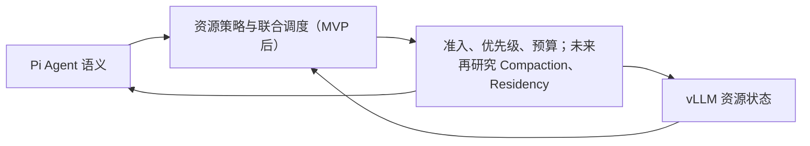
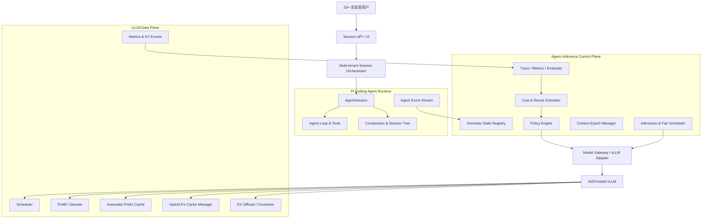
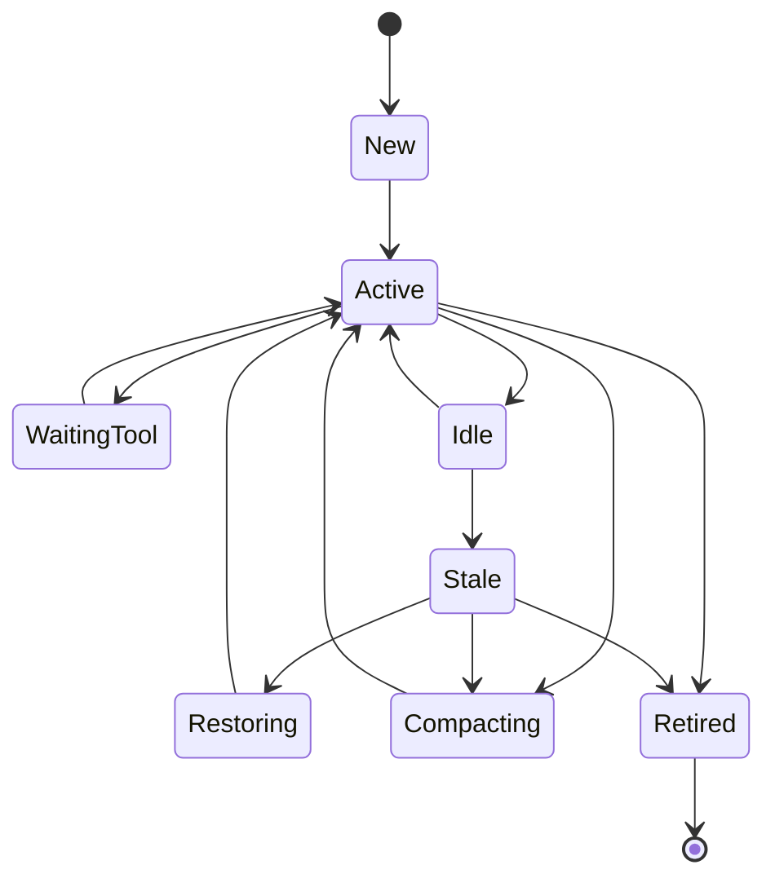
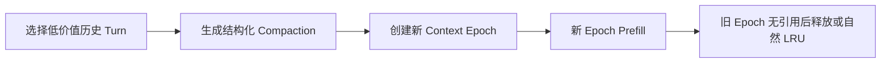

# VRAM-Aware Agent Harness：深度分析与长期实施规划

> 文档版本：v4.4
>
> 文档性质：架构背景、Idea 可行性分析与条件式 Agent–Inference 研究材料
>
> 当前核心定位：支持团队共享本地模型的多租户 Agent 任务服务
>
> 研究方向：Agent–Inference Co-scheduling 保留为实测触发的候选支线，不是当前实施主线

> **当前实施入口（2026-08-12）**：Day 1–7、Stage 1–2 本地语义已经完成。项目
> 通过 [`ADR 0009`](adr/0009-build-a-multi-tenant-agent-task-service.md)
> 定位为面向真实用户的多租户 Agent 任务服务；当前唯一实施顺序见
> [`multi-tenant-agent-task-service-roadmap.zh-CN.md`](multi-tenant-agent-task-service-roadmap.zh-CN.md)。
> 本文第 2 节起的大量 vLLM、Prefix/KV 和 Co-scheduling 内容继续作为历史分析和
> 条件式研究材料；Claude、异构 ResourcePool 和大型控制面内容也只保留为秋招后
> 参考，不能覆盖新路线图的优先级。

> **历史实施入口（2026-07-19）**：本文保留早期 Agent–Inference 联合调度的完整分析，用于理解项目背景和后续研究方向；第一周不依赖深度重写 vLLM Scheduler 或管理物理 KV Cache。当时的 Harness-first MVP 实现顺序和验收标准见 [`ONE_WEEK_HARNESS_MVP_GUIDE.zh-CN.md`](../ONE_WEEK_HARNESS_MVP_GUIDE.zh-CN.md)，该手册现已完成并冻结。
>
> **源码状态（2026-07-22）**：自研 Agent Loop、内存 ContextManager、直接 vLLM Client 与 `src/kv/*` 实验已经移除，避免与 Pi 主路径形成双重实现。新源码从 `runtime/` 的稳定接口和 `spikes/` 的 Pi 验证开始，随后进入 `runs/`、`events/`、`tools/`、`checkpoints/`、`policy/`、`resources/` 与 `storage/`。删除决策见 [`ADR 0002`](adr/0002-remove-legacy-agent-prototype.md)。
>
> **策略方向（2026-07-23）**：固定阈值只作为第一阶段的安全基线和故障回退。后续使用 Scheduling Agent 综合资源趋势、任务、队列、Tenant/SLO 和历史结果，先运行 Shadow Mode，再在 Hard Guardrails 内参与真实调度。见 [`ADR 0003`](adr/0003-guarded-agentic-resource-scheduling.md)。
>
> **多租户定位（2026-07-26）**：Tenant 不是后加的数据库字段，而是身份、权限、Workspace、Secret、配额、公平性、成本和审计的共同主体。第一阶段先证明逻辑隔离和确定性公平，后续再增加生产级认证与运行环境隔离。见 [`ADR 0004`](adr/0004-multi-tenancy-as-first-class-boundary.md)。
>
> **模型与推理基线（2026-07-30）**：Harness 不绑定特定模型。当前以单卡 RTX A6000 48 GB 为硬件基线，Qwen3.5-4B 用于高频开发，Qwen3.5-9B 用于主要集成验证；vLLM fork 可以增加观测、请求归因和后续调度扩展，但模型配置不能进入 Harness 业务逻辑。见 [`ADR 0005`](adr/0005-use-replaceable-models-and-extensible-vllm.md)。
>
> **范围收紧（2026-08-03）**：MVP 的双核心固定为“副作用感知的安全恢复”和
> “基于真实资源事实的准入/背压”。多租户只保留为归属、公平性和非饥饿的验证
> 场景；Scheduling Agent 与深度 vLLM 调度均为数据驱动的候选研究方向，不是
> 当前交付承诺。见 [`ADR 0006`](adr/0006-narrow-mvp-to-recovery-and-resource-admission.md)。

## 1. 结论先行

本项目当前的规范定义是：

> **支持团队共享本地模型的多租户 Agent 任务服务：用户在独立 Workspace 中提交
> 任务、观察执行并取得回答、Diff 和 Artifact；系统使用 Pi 驱动自托管 vLLM，
> 为每个 Attempt 分配受策略约束的 Sandbox，公平调度共享 GPU，并通过副作用记录、
> Checkpoint 和审计时间线保证故障后的安全恢复。**

项目已经基于 Pi Coding Agent 完成可靠执行纵向切片，并让 HarnessTemplate、
HarnessInstance、RuntimeCapabilityProfile、EffectivePolicySnapshot 与最小
Sandbox 进入真实 Pi 路径。这些实现继续保留，但秋招前不再接入 Claude 或扩张
异构 ResourcePool。Tenant 是用户、Workspace、策略、Secret、资源、结果和审计的
共同边界，不是普通 CRUD 字段。产品只实现支撑任务闭环所需的身份与管理能力，
不扩张为通用企业 SaaS 平台。

第一周 MVP 要回答的是一个受约束的工程问题：

> 在不修改 Pi、且不依赖深度重写 vLLM Scheduler 的情况下，Harness 能否依据
> Run 状态、工具副作用和真实资源事实，安全地控制新任务启动，并在故障或资源
> 压力解除后自动、可解释地继续执行？

这条问题已经形成可靠的本地语义基线。后续主线不是立即进入 Agent–Inference
Co-scheduling 或双 Runtime，而是补齐可信身份、受管 Workspace、真实容器 Sandbox、
用户结果与操作界面，并以 A6000、多租户攻击测试、资源竞争、kill/restart 和副作用
恢复实验提供证据。完成产品闭环后，才根据目标岗位和实测结果决定是否研究优先级、
Prefill/Decode 成本、缓存复用或第二 Runtime。

项目不应被狭义定义为“Turn 级 KV 驱逐器”。KV Cache 是未来可能观测和优化的
重要资源，但不是预先假定的唯一瓶颈，也不一定是第一阶段最值得优化的资源。

多租户既是用户产品的使用边界，也是共享单机 GPU 的资源竞争场景：Tenant 必须
贯穿身份、Workspace、策略、Sandbox、Secret、资源、结果和审计。第一版需要可信
认证和最小任务 UI，但不优先做计费、复杂组织管理或通用低代码后台；隔离能否落实、
故障能否安全恢复、资源能否真实影响执行，仍然决定项目的工程深度。

## 2. 为什么必须先修正问题定义

> 本节记录早期 DeepSeek-V4-Flash 大模型部署假设及其推导，作为未来大模型和 KV
> 研究的历史材料。它不再代表当前 MVP 的模型与硬件基线；当前执行基线以
> A6000 + Qwen3.5-4B/9B 为准。

早期设计建立在以下推理上：

1. 模型权重占据约 145–150 GB；
2. 只剩约 42–47 GB 显存；
3. 20 人使用长上下文 Coding Agent；
4. 因此 KV Cache 必然成为首要瓶颈；
5. Harness 应按 Turn 主动压缩或驱逐 KV。

前四步中，前三步是环境事实，第四步仍是需要实测的假设。

DeepSeek-V4 的 CSA/HCA 已经同时在注意力计算和 KV 长度维度上做压缩。vLLM 官方实现说明，DeepSeek-V4 在 1M 上下文、BF16 KV 下每条序列约需 9.62 GiB KV；实际使用 FP8 attention cache 与 FP4 indexer cache 后还会进一步下降约一半。

因此，早期用“每个原始 token × 512 维 × 所有层”估算约 60 KB/token，会明显高估实际 KV 增长。该估算没有完整计入：

- C4 层约 4:1 的长度压缩；
- C128 层约 128:1 的长度压缩；
- 仅保留短窗口的未压缩局部状态；
- compressor rolling state 的固定窗口；
- FP8/FP4 KV 与 indexer 存储；
- Hybrid KV Cache Manager 的实际分组和 page layout。

这会改变优化优先级。在 20 人低频使用、平均上下文仅数万 token 的情况下，真正的主要瓶颈可能是：

- 长请求的 Prefill 算力；
- 多个 Agent 同时生成时的 Decode 吞吐；
- Think/Think Max 产生的长输出；
- CUDA Graph、MoE workspace、通信和临时 buffer；
- 大请求阻塞短交互请求造成的尾延迟；
- 重复 Prefill 和较低的 Prefix Cache 命中；
- 多租户之间缺少公平调度；
- 最后才可能是 KV 容量本身。

所以第一原则是：

> 先测量资源瓶颈，再选择控制动作；不能因为 Harness 能看见 KV，就把所有问题解释成 KV 问题。

## 3. 项目的核心差异化

### 3.1 普通 Coding Agent 知道什么

- 用户目标；
- Session 历史；
- 当前 Turn；
- 工具调用与工具结果；
- 当前是否在等待工具；
- 哪些文件被读取或修改；
- 是否发生 compaction；
- 当前任务是否仍在连续执行。

### 3.2 普通推理引擎知道什么

- 请求到达时间；
- Prompt 和输出 token；
- 当前运行与等待请求；
- KV Block 的分配、引用与缓存命中；
- Prefix Block 是否可复用；
- 请求是否需要抢占或重计算；
- GPU/CPU KV Cache 水位；
- Prefill 与 Decode 的运行状态。

### 3.3 两者各自缺失什么

Pi 不知道一段逻辑上下文在 vLLM 中的物理成本，也不知道其他用户正在竞争多少推理资源。

vLLM 不知道某个请求为何重要、是否来自实时交互、是否正在等待工具、是否即将恢复、是否属于高重建成本的长任务。

### 3.4 我们增加什么

长期看，Harness 可以把两类信息连接起来：

核心差异不是拥有更多启发式规则，而是形成闭环：

> Agent 语义 → 资源价值判断 → 推理动作 → 真实资源反馈 → 更新 Agent 调度。

第一周只实现这个闭环的最小前半段：持久化 Agent 事实、采集粗粒度 GPU 状态，
并用确定性策略决定新 Run 的启动或排队。更细的推理动作必须由后续测量证明其
必要性，不能从研究设想反推当前接口。

### 3.5 为什么多租户是核心变量

单租户 Agent 可以把当前用户、当前 Workspace、当前 Session 和当前资源预算
都藏在进程全局状态中；多租户 Harness 不允许这些隐式假设存在。

Tenant 必须贯穿：

- Session、Run、Event、ToolExecution 和 Checkpoint 的所有权；
- Workspace、Secret、工具策略和外部数据访问；
- 并发、Token、费用、显存预算、队列权重和 SLO；
- 日志、指标、恢复操作和策略决策的审计归属。

因此，多租户带来的价值不只是“支持更多用户”，而是迫使系统形成清晰、可测试、
可扩展的控制面边界。具体约束见 [`ADR 0004`](adr/0004-multi-tenancy-as-first-class-boundary.md)。

## 4. 为什么选择 Pi，而不是继续当前自研 Agent Loop

### 4.1 Pi 已经提供的能力

当前 Pi SDK 已具备：

- AgentSession 与持久化 SessionManager；
- AgentSessionRuntime 的新建、恢复、分支和导入；
- 工具注册与 Coding Tools；
- turn、agent、message、tool execution 等事件；
- 自动 compaction 与分支摘要；
- 自定义模型和 Provider；
- Extension 与 provider request hook；
- SDK、RPC 和 JSON event stream 三种集成方式；
- 项目 Context Files 与 Skills。

这些正是当前仓库自行实现、但尚未达到生产质量的部分。

### 4.2 推荐集成方式

第一阶段使用 Pi SDK 嵌入，而不是直接 fork Pi：

- 每个活跃服务会话对应一个 Pi AgentSession；
- 服务层维护 Tenant → Session 的路由与生命周期；
- 订阅 Pi 的 turn、tool、compaction 和 agent 事件；
- 使用自定义 Provider 或兼容 Provider 连接 Model Gateway；
- 在请求 hook 中注入 tenant、session、epoch、latency class 等元数据；
- Harness 自己实现多 Session 调度与资源策略。

只有当 SDK/Extension 无法提供必要 hook 时，才对 Pi 做小范围 fork。这样可以避免长期背负 Agent Runtime 的维护成本。

### 4.3 Pi 不替我们解决的部分

- 20 人多租户配额；
- 跨 Session Admission Control；
- GPU 资源公平调度；
- vLLM KV 与请求事件归因；
- Agent-aware request priority；
- Prefill/Decode 成本预测；
- Session 热度与恢复概率；
- KV offload/residency 策略；
- 自托管推理 SLO；
- 多用户工作区和进程隔离。

这些才是本项目应当自研的核心。

## 5. 总体架构

## 6. 统一对象模型

### 6.1 对象链

> Tenant → Workspace → Agent Session → User Task/Turn → Agent Step → Model Request → Context Epoch → Prefix Block / KV Cache Group

这些对象不能混为一谈。

| 对象 | 含义 | 主要职责 |
| --- | --- | --- |
| Tenant | 资源和权限主体 | 配额、公平性、审计 |
| Workspace | Coding Agent 操作环境 | 文件与进程隔离、项目上下文 |
| Agent Session | 可恢复的长期任务会话 | 历史、分支、compaction、恢复 |
| User Task/Turn | 一次用户目标到最终回应 | 语义价值、任务状态 |
| Agent Step | 一次模型响应及后续工具行为 | Agent loop 观测 |
| Model Request | 一次真实推理请求 | 调度、计费、KV 归因 |
| Context Epoch | 一版确定的 Prompt 序列 | Prefix 复用、重建、退休 |
| KV Block Group | vLLM 物理缓存单位 | 分配、共享、迁移、释放 |

### 6.2 Session 是服务调度单元

Session 至少需要以下状态：

状态应驱动资源动作：

| Session 状态 | 资源含义 | 可能动作 |
| --- | --- | --- |
| Active | 延迟敏感、短期继续概率高 | 高优先级、保护运行请求 |
| WaitingTool | 暂停推理但很可能继续 | 短工具保留热度，长工具允许降级 |
| Idle | 短时空闲 | 保持 Prefix Cache 自然复用 |
| Stale | 恢复概率下降 | 降低 residency 价值，必要时 offload |
| Restoring | 即将产生新推理 | 预取或预留 Admission Budget |
| Compacting | 正在创建新上下文版本 | 低优先级后台 Prefill/摘要 |
| Retired | 不再需要原上下文 | 解除引用、等待安全回收 |

### 6.3 Turn 是语义单位，不是天然物理块单位

一个 Coding Agent 的 User Turn 可能包含多次模型请求和多个工具结果。因此必须区分：

- User Turn：一次用户目标；
- Agent Step：一次模型输出；
- Tool Event：一次工具调用和结果；
- Model Request：真正进入 vLLM 的请求。

Turn 可用于：

- 判断任务主线；
- 选择摘要内容；
- 记录未解决问题；
- 估算重建价值；
- 标识一次性工具输出；
- 构造新的 Context Epoch。

Turn 不应直接用于：

- 绕过 vLLM 删除任意中间 KV；
- 假设消息边界与物理 Block 边界一致；
- 在不重新 Prefill 的情况下改变序列中间内容。

### 6.4 Context Epoch 是逻辑与物理之间的桥梁

Context Epoch 表示一版不可变、可确定性重建的模型输入前缀。

当 Pi compaction、任务分支、项目上下文变化或工具集合变化时，应创建新 Epoch，而不是假设旧 Prefix 仍可完整复用。

每个 Epoch 需要记录：

- Session 与分支；
- 模型、Tokenizer、Chat Template 版本；
- System Prompt 版本；
- Tool Schema 版本与确定性排序；
- Project Context 指纹；
- Compaction Summary 指纹；
- Token 数和预计 Prefill 成本；
- 对应请求和 Prefix Hash；
- 创建、最后使用与退休时间。

Context Epoch 的价值在于：

- 可以准确判断逻辑前缀是否真的相同；
- 可以估算恢复时的 Prefill 成本；
- 可以在 compaction 后明确退休旧版本；
- 可以把 Turn 级语义修改转化为安全的新请求序列。

## 7. Prefix Cache 的正确使用方式

### 7.1 Prefix Cache 不是 Session Cache

vLLM 的 Automatic Prefix Caching 基于 Block Hash。相同 token 前缀可跨请求甚至跨 Session 共享；一个 Session 的缓存也可能被多个物理块和多个请求共同引用。

因此不能简单声称：

> Session A 占用了 X GB 专属 KV。

更准确的归因应区分：

- Session 私有块；
- 多 Session 共享块；
- 正在运行请求引用的块；
- 已完成请求留下的可复用缓存块；
- 外部 KV Store 中的副本。

### 7.2 应稳定的内容

- System Prompt 版本；
- Tool Schema 内容和顺序；
- Chat Template；
- 项目规则和 Context Files 的序列化；
- 工具结果的结构化格式；
- 模型与 Tokenizer 版本。

### 7.3 不应为了 Prefix Cache 扭曲 Agent 语义

Compaction 一定会改变某个位置之后的 token，因此会产生新的 Prefix。试图让 frozen summary 无限单调增长，并不能保证后续缓存一直命中；只要 summary 内容在原位置变化，后续 Block Hash 就会改变。

正确策略是：

- 稳定公共和项目级前缀；
- 在一个 Epoch 内保持确定性追加；
- 降低 compaction 频率；
- 在空闲或压力阶段执行 compaction；
- 接受新 Epoch 的一次重建成本；
- 用实测判断旧 Epoch 是否值得主动释放。

### 7.4 多租户安全

vLLM 支持通过 cache salt 隔离 Prefix Cache，但 salt 会进入首个 Block 的 Hash 链。

需要在两者之间做明确选择：

- 实验室内部互信：允许共享公共 System/Tool Prefix，获得更高命中；
- 不同安全域：使用 tenant salt，牺牲跨租户共享以避免缓存侧信道。

不能一边要求全局共享 Prefix，一边假设天然具备租户隔离。

## 8. KV Cache：保留什么、修正什么

### 8.1 应当保留的核心 Idea

- Harness 感知真实 KV 水位；
- 请求和缓存事件关联到 Session/Epoch；
- 压力下优先保护活跃交互；
- 依据恢复概率和重建成本，而不是纯 LRU 做跨 Session 决策；
- 在值得重用时使用 CPU/offload tier；
- 在新 Epoch 建立后让旧 Epoch 进入退休流程；
- 以实验验证 latency、capacity、quality 与 fairness。

### 8.2 必须修正的 Idea

#### “Warm = GPU 上压缩后的 Turn KV”

不建议作为生产定义。DeepSeek-V4 的 KV 已由模型架构压缩，二次选择性删除可能破坏 compressed state、位置关系、稀疏索引和 Prefix Cache 一致性。

更安全的定义是：

- Hot：本地 GPU KV；
- Warm：CPU 或外部 KV Store 中的完整可恢复 Prefix；
- Cold：不保留物理 KV，只保留可重建的逻辑 Session/Epoch；
- Retired：逻辑版本已失效，等待确认无引用后回收。

#### “直接 evict 中间 Turn”

不作为 MVP。vLLM Prefix Cache 只缓存完整 Block；DeepSeek-V4 还存在 256 native-token 的逻辑块、C4/C128 compressed entries 和 compressor rolling state。

安全路径是：

#### “运行中的 CoT 被驱逐会失去推理能力”

需要改写。vLLM 抢占运行请求时会释放请求 Block，并将已计算 token 位置重置以便重计算；主要损失是算力和尾延迟，不等同于模型永久丢失已经生成的 token。

正确动作是：

- 给实时、已投入大量 Prefill 的请求更高 priority；
- 限制超长 Think 请求并发；
- 对后台任务允许抢占；
- 记录 preemption 与 recompute token 成本。

不必为了这一点给 Turn Block 增加不可淘汰标记。

### 8.3 降为实验项的 Idea

- Turn → Block 精细映射；
- 模型自标注历史引用；
- Turn 级局部 KV 删除；
- Attention score 驱动语义重要性；
- 混合边界 Block 重算；
- DeepSeek-V4 特定的稀疏索引局部编辑。

这些方向可能形成研究成果，但不应阻塞可用系统。

## 9. 真正的资源调度模型

### 9.1 需要联合考虑的资源

| 资源 | 典型成本 | Harness 可采取的动作 |
| --- | --- | --- |
| Prefill Compute | 与待计算 Prompt token 相关 | 排队、chunk、compaction、prefix 复用 |
| Decode Compute | 与活跃序列和输出长度相关 | priority、并发限制、thinking budget |
| GPU KV | 与活跃/缓存前缀相关 | Admission、自然 LRU、offload、release hint |
| CPU KV | 与 offload 容量和带宽相关 | residency 配额、prefetch |
| Temporary VRAM | 与 kernel、MoE、CUDA Graph 相关 | 保留安全余量、限制并发形态 |
| Workspace Compute | 工具进程、测试和构建 | 容器配额、并行限制 |

### 9.2 请求分类

建议至少区分：

- Interactive：用户正在等待的短交互；
- Continuation：同一 Session 的快速后续；
- Tool Resume：工具返回后即将继续；
- Large Prefill：新长 Session 或重建请求；
- Long Think：预计输出很长的推理；
- Background：compaction、摘要和非交互任务。

### 9.3 调度目标

调度目标不是单一最大吞吐，而是：

> 在不 OOM 的前提下，最小化交互请求尾延迟，限制重复 Prefill，维持用户公平，并尽量提高 GPU 有效利用率。

### 9.4 跨 Session 保留价值

可解释的初始策略可以使用：

> 保留价值 = 恢复概率 × 重建成本 + 共享收益 + 交互优先级 − 显存机会成本 − 租户超额惩罚

其中：

- 恢复概率来自 Session 活跃度、工具状态和用户行为；
- 重建成本来自未命中 Prefix 的 token 数和实测 Prefill 速度；
- 共享收益来自 Prefix Block 的引用范围；
- 机会成本取决于 KV 字节数和当前压力；
- 超额惩罚保证单用户不能长期占据全部缓存。

第一版使用规则和滑动统计，不需要机器学习。

### 9.5 公平性

建议使用分层公平策略：

1. 每个 Tenant 限制同时运行的 Agent 请求；
2. 交互请求优先于后台 compaction；
3. 在同一优先级内使用等待时间防止饥饿；
4. 大 Prefill 使用独立并发槽；
5. 长 Think 使用输出预算和并发配额；
6. 统计 Prefill token、Decode token、GPU 时间和 KV residency，而不只统计请求数。

## 10. 与 vLLM 的集成分级

### Level 0：标准接口与 Metrics

不要求修改 vLLM 核心调度：

- OpenAI/Anthropic 兼容推理；
- 请求 usage；
- Prometheus metrics；
- Prefix Cache hit；
- running/waiting 请求；
- TTFT、ITL、E2E latency；
- Harness 外部 Admission Queue。

这一层足以建立真实基线和第一版公平调度。若当前 fork 缺少稳定的请求标识或
观测字段，可以做局部扩展，但不需要改变 Scheduler 行为。

### Level 1：请求元数据与 Priority

薄改造或 Gateway 注入：

- tenant id；
- session id；
- context epoch id；
- request class；
- scheduler priority；
- trace id；
- cache security salt。

这一层是 MVP 形成可靠 Level 0 基线后，Co-scheduler 研究最先考虑的 vLLM
增强，不属于第一周交付。

### Level 2：KV Events 与 Offload Policy

尽量复用 vLLM 已有扩展点：

- KV Block stored/removed events；
- KV Connector；
- native CPU offload 或 LMCache；
- per-request offloading policy；
- Prefix Hash 与 Cache Group 元数据；
- connector transfer metrics。

Harness 在这一层建立 Session/Epoch 与 KV 的可信归因。

### Level 3：实验性 vLLM 改造

只有在 Level 0–2 的数据证明存在明确收益空间后再做：

- Agent-aware cache replacement；
- 自定义 retention hint；
- 更细粒度的 token-offset offload；
- DeepSeek-V4 特定 Block/Epoch 回收；
- Turn 语义辅助的实验性策略。

原则是优先接入现有 KV Events、KV Connector 和 OffloadingManager，而不是首先在 KVCacheBlock 上增加大量业务字段。

## 11. 对早期 Idea 的最终判定

| 早期 Idea | 判定 | 调整后的定位 |
| --- | --- | --- |
| 基于 Pi Coding Agent | 保留并加强 | 使用 Pi SDK，停止重复实现 Agent Loop |
| 多 Session 管理 | 核心保留 | Tenant/Workspace/Session 服务层 |
| new/active/stale | 保留但扩展 | 事件驱动状态机，阈值随压力动态调整 |
| 六层消息结构 | 保留思想，放弃固定形态 | 复用 Pi Context/Compaction，以 Epoch 描述版本 |
| Prefix 字节级稳定 | 保留 | 同时固定 Chat Template、Tools 和序列化 |
| frozen summary 单调增长 | 修正 | Epoch 内不可变；重压缩时创建新 Epoch |
| Turn 重要性 | 保留为语义信号 | 用于 compaction，不直接决定物理 Block 删除 |
| 模型 `<refs>` 自标注 | 实验项 | 不进入默认 System Prompt，不作为正确性依赖 |
| Jaccard off-topic | 放弃生产使用 | 可作为弱实验特征，不能支持中文和代码语义 |
| Hot/Warm/Cold | 保留概念 | GPU / CPU-external / logical-only，而非局部破坏 KV |
| 任意 evict_turn | 放弃 MVP | 通过新 Epoch + re-prefill + 旧 Prefix 回收 |
| protected CoT Block | 修正 | 使用 request priority 和重算成本保护 |
| 跨 Session rebuild cost | 核心保留 | Co-scheduler 的关键差异化 |
| 动态显存水位 | 核心保留 | 扩展为 Prefill/Decode/KV/临时显存联合状态 |
| 固定 70/85/95 阈值 | 仅作为起始实验 | 先由实际 OOM 余量和 latency 曲线校准为确定性基线，再作为 Agentic Policy 的回退与对照 |
| Attention score 驱逐 | 放弃主线 | fused kernel 与语义错位，收益不确定 |

## 12. 历史代码评估（已结束）

> 本节记录 2026-07-22 以前旧原型的评估依据。相关自研 Agent Loop、直接
> LLM Client、ContextManager 和 KV 实验已经移出当前主路径，不能再用本节
> 判断现在的源码进度。

### 12.1 当时的性质

当时的代码是一个验证早期设计的最小 Spike，不是 Pi 二次开发，也不是可继续
直接演进的生产骨架。

它自行实现了：

- LLM Client；
- Agent Loop；
- Context Manager；
- Output Validator；
- Turn Importance Evaluator；
- 模拟的 KV Lifecycle Manager。

### 12.2 当时的主要结构性问题

- `package.json` 没有 Pi 依赖；
- Harness 没有实例化或调用 KV Lifecycle Manager；
- vLLM KV Client 只有接口和测试 Mock，没有真实实现；
- 多 Tenant、Session Router、Admission Queue 和 Monitor 尚不存在；
- Session 仅保存在进程内存；
- 工具过程中的中间消息没有完整持久化到 Session；
- Prefix 守卫在主流程中校验了用户消息，而不是 System Prompt；
- Turn 原文未进入 KV Manager 的可恢复存储；
- Warm 只是内存标签，没有执行实际 offload；
- eviction cycle 使用一次读取的旧水位，动作后没有重新观测；
- 中文文本在当前 Jaccard tokenizer 中会丢失，意图分类不可用；
- `<refs>` 指令已进入 System Prompt，但没有完整接入主流程；
- 测试以构造器和 Mock 为主，没有真实 Harness → vLLM 端到端验证。

当时的 52 个测试通过，只能说明这些局部 API 在 Mock 条件下符合断言，不能证明
系统已经具备 Agent 或 KV 管理能力。

### 12.3 已执行的处理决定

决定不在旧 Agent Loop 上修补后继续扩展。

- 旧实现已作为 legacy prototype 从工作树删除，Git 历史继续保留；
- 新主线已经从 Pi SDK Adapter 和稳定 Runtime 接口开始；
- Turn Importance 与 KVLifecycleManager 不进入 MVP 主路径；
- 后续只有在真实测量证明必要时，才重新设计相应策略模块。

## 13. 历史 Agent–Inference 研究阶段

> **状态说明（2026-08-12）**：下列 Phase 0–5 是 ADR 0007 之前形成的
> Agent–Inference 深化方案，保留用于解释 A6000、Prefix/KV 与 vLLM 研究脉络，
> 不再是当前产品实施顺序。其中 Pi Runtime、基础资源准入和最小多租户编排已经
> 在 Day 1–7 以较小范围完成；未完成部分只有在产品任务闭环完成且真实数据证明必要时
> 才重新进入。当前主线只以
> [`multi-tenant-agent-task-service-roadmap.zh-CN.md`](multi-tenant-agent-task-service-roadmap.zh-CN.md)
> 为准。

### Phase 0：建立事实基线

目标：证明瓶颈到底在哪里。

必须获得：

- 当前 vLLM fork 的准确 commit；
- Qwen3.5 兼容 patch、依赖版本和量化配置；
- 完整启动参数；
- Tensor Parallel、KV dtype、block size、Prefix Cache 与 max model len；
- 模型加载后的显存分解；
- 实际 KV Cache 总容量和 group-aware token capacity；
- 不同 Prompt/输出长度下的 TTFT、ITL、吞吐和峰值显存；
- 1、2、4、8、20 Session 负载曲线；
- Prefix 命中、抢占和重算行为。

工作负载至少覆盖：

- 短 Prompt + 短输出；
- 长 Prefill + 短输出；
- 短 Prompt + 长 Think；
- 多个 Session 交错恢复；
- 相同系统和工具前缀；
- compaction 前后请求；
- 工具等待后恢复。

退出条件：能够用数据回答 KV、Prefill、Decode 和临时显存谁是主要瓶颈。

### Phase 1：切换到 Pi Runtime

目标：建立正确的 Agent 基础。

产出：

- Pi SDK Adapter；
- 可配置的自托管 vLLM Provider，当前用 Qwen3.5-4B/9B 验证；
- Pi AgentSession 生命周期；
- Tool/Turn/Compaction 事件订阅；
- Session 持久化；
- 当前 Coding Agent 能力的 Smoke Test；
- 每次 Model Request 的 trace id。

退出条件：不使用当前自制 Agent Loop，也能完成真实多轮 Coding Agent 工具任务。

### Phase 2：多租户 Session Orchestrator

目标：让 20 人能够被安全、公平地服务。

产出：

- Tenant、Workspace、Session 数据模型；
- 每用户并发限制；
- 交互/后台请求分类；
- Weighted Fair Queue；
- 大 Prefill 独立槽位；
- Thinking Budget；
- Session 状态机；
- 工作区与进程隔离策略。

退出条件：在模拟 20 人负载下无饥饿，短交互不会长期被大请求阻塞。

### Phase 3：Context Epoch 与 Prefix 优化

目标：减少无意义的重复 Prefill。

产出：

- Context Epoch Registry；
- System/Tool/Project Prefix 指纹；
- 确定性 Tool Schema 与序列化；
- Pi Compaction 与 Epoch 切换联动；
- Prefix Cache hit 按 Session/Epoch 归因；
- Compaction 的成本收益评估。

退出条件：能够解释每个请求为何命中或未命中 Prefix，并证明策略减少重复 Prefill。

### Phase 4：vLLM 资源闭环

目标：用真实资源反馈控制 Admission 和 Priority。

产出：

- Model Gateway 元数据贯通；
- vLLM request priority；
- Metrics 与 KV Events 消费；
- 资源状态快照；
- 压力策略；
- 动作后重新观测；
- 决策审计。

退出条件：压力下不会 OOM，且交互请求 P95 延迟和公平性优于原生 FCFS。

### Phase 5：KV Residency 实验

只有 Phase 0/4 证明 KV residency 是显著瓶颈时启动。

优先顺序：

1. vLLM native CPU offload；
2. LMCache 或 KV Connector；
3. per-request offload policy；
4. Session 恢复预取；
5. Agent-aware replacement hint；
6. 最后才是 DeepSeek-V4 特定的细粒度实验。

退出条件：相较直接重算，offload/restore 在目标负载下有稳定的净收益。

## 14. 实验矩阵

### 14.1 系统对照组

1. 原生 vLLM + FCFS；
2. Pi + 原生 vLLM；
3. 加入公平 Admission；
4. 加入 Priority 与请求分类；
5. 加入 Context Epoch / Prefix 优化；
6. 加入 KV Events 观测；
7. 加入 Offload/Restore；
8. 完整联合策略。

### 14.2 核心指标

资源：

- GPU 峰值显存和安全余量；
- KV Cache 使用块与 token capacity；
- CPU KV 使用量；
- Prefill 与 Decode GPU 时间；
- 重算 token；
- offload/restore 字节与耗时。

体验：

- TTFT P50/P95/P99；
- ITL；
- Session 恢复延迟；
- 排队时间；
- 工具返回到下一次模型请求的延迟；
- 任务完成率。

效率：

- Prefix Cache hit rate；
- 每任务总 Prefill token；
- 每任务总 Decode token；
- GPU 有效吞吐；
- 每单位 GPU 时间完成的 Agent Turn。

公平性：

- 各 Tenant 等待时间分布；
- 最大连续占用；
- 饥饿次数；
- 交互请求被后台任务阻塞的比例。

质量：

- compaction 前后任务完成率；
- 长任务约束保留率；
- 文件修改正确性；
- Session 恢复后重复操作或遗忘率。

## 15. 决策门槛

在 Phase 0 后按数据选择主线：

### 如果 KV 使用率低，但 TTFT 高

优先做：

- Prefix 命中；
- Chunked Prefill；
- 大 Prefill 隔离；
- Priority；
- Fair Queue。

### 如果 Decode 饱和

优先做：

- 活跃请求并发控制；
- Think/Think Max 配额；
- 输出 token 预算；
- 交互与后台任务分级。

### 如果 KV 水位高且重复恢复多

优先做：

- Context Epoch；
- Prefix 稳定；
- CPU/offload tier；
- Session 恢复预取；
- Agent-aware residency。

### 如果临时显存造成 OOM

优先做：

- 精确 KV memory budget；
- 保留 runtime headroom；
- 控制请求形态和并发；
- 调整 CUDA Graph 和 engine 配置；
- 不应首先做 Turn 驱逐。

## 16. MVP 后的核心研究问题

这个项目最有价值的研究问题不是：

> 能不能删除某一轮对话的 KV？

而是：

> 当 Agent Runtime 能够提供 Session 活跃度、工具等待、上下文版本、任务阶段和重建成本时，这些语义能否让自托管推理系统在固定 GPU 预算下，比纯 FCFS/LRU 获得更好的延迟、公平性与有效吞吐？

该问题同时具备：

- Agent Runtime 价值；
- Inference Infra 深度；
- 多租户系统设计；
- 可量化实验；
- 可扩展到其他自托管模型的通用性。

## 17. 进入 vLLM 深度研究前必须补齐的外部信息

实验室拥有可修改的 vLLM fork，但它尚未作为本 Workspace 的源码依赖接入，
因此还不能在本文中固定具体改造文件和函数。

进入 vLLM 资源闭环和 KV 实验前需要接入：

- vLLM fork 仓库或准确 commit；
- 当前服务启动命令和配置；
- Qwen3.5 兼容 patch、依赖和量化配置列表；
- 当前 `/metrics` 样本；
- 一组代表性请求日志，至少包含 Prompt/输出 token 与延迟；
- 服务器 CPU 内存和 PCIe/NVLink 拓扑；
- 可用于压测的非生产时段。

这些信息不阻塞当前控制面 MVP，但在它们到位前不应承诺具体 KV 驱逐接口。

## 18. Agent–Inference 候选研究边界

本项目的规范定义以第 1 节和 ADR 0009 为准。完成当前产品闭环后，可以由真实数据
触发跨层资源研究：

> Runtime 管理 Agent 如何工作；Harness Control Plane 管理不同 Agent 何时、以
> 什么策略和预算使用某个 ResourcePool；vLLM 或远程模型 Provider 管理推理资源
> 的物理正确执行。

在 Pi + 本地 vLLM 场景中，三者的候选研究边界是：

- Pi：Session、工具、Turn、compaction 和 Agent 体验；
- Harness：Tenant、Template/Instance、跨 Session 调度、成本模型、资源策略和评估；
- vLLM：Scheduler、Prefill/Decode、Prefix Cache、KV Block、Offload 和物理正确性。

研究假设仍然有价值：Agent 语义状态可能成为自托管推理调度器可以利用的资源
信号。但它必须作为候选深度优化接受对照实验，不能重新覆盖多租户公平、策略落实、
安全恢复和审计这条当前主线。

## 19. 参考资料

- [Pi Agent Harness](https://github.com/earendil-works/pi)
- [Pi SDK](https://pi.dev/docs/latest/sdk)
- [Pi Compaction](https://pi.dev/docs/latest/compaction)
- [Pi Extensions](https://pi.dev/docs/latest/extensions)
- [Pi Session Format](https://pi.dev/docs/latest/session-format)
- [Qwen3.5-4B Model Card](https://huggingface.co/Qwen/Qwen3.5-4B)
- [Qwen3.5-9B Model Card](https://huggingface.co/Qwen/Qwen3.5-9B)
- [NVIDIA RTX A6000](https://www.nvidia.com/en-us/products/workstations/rtx-a6000/)
- [DeepSeek-V4-Flash Model Card](https://huggingface.co/deepseek-ai/DeepSeek-V4-Flash)
- [vLLM DeepSeek-V4 Implementation Notes](https://github.com/vllm-project/vllm-project.github.io/blob/main/_posts/2026-04-24-deepseek-v4.md)
- [vLLM Automatic Prefix Caching](https://docs.vllm.ai/en/latest/design/prefix_caching/)
- [vLLM Hybrid KV Cache Manager](https://docs.vllm.ai/en/latest/design/hybrid_kv_cache_manager/)
- [vLLM Cache Configuration](https://docs.vllm.ai/en/latest/api/vllm/config/cache/)
- [vLLM KV Events](https://docs.vllm.ai/en/latest/api/vllm/config/kv_events/)
- [vLLM KV Connector](https://docs.vllm.ai/en/latest/api/vllm/distributed/kv_transfer/kv_connector/v1/)
- [vLLM Scheduler](https://docs.vllm.ai/en/latest/api/vllm/v1/core/sched/scheduler/)
